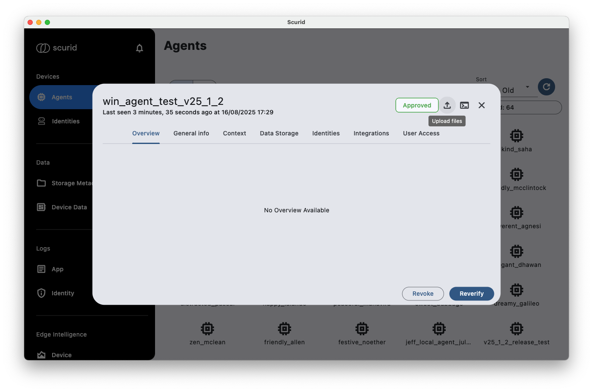
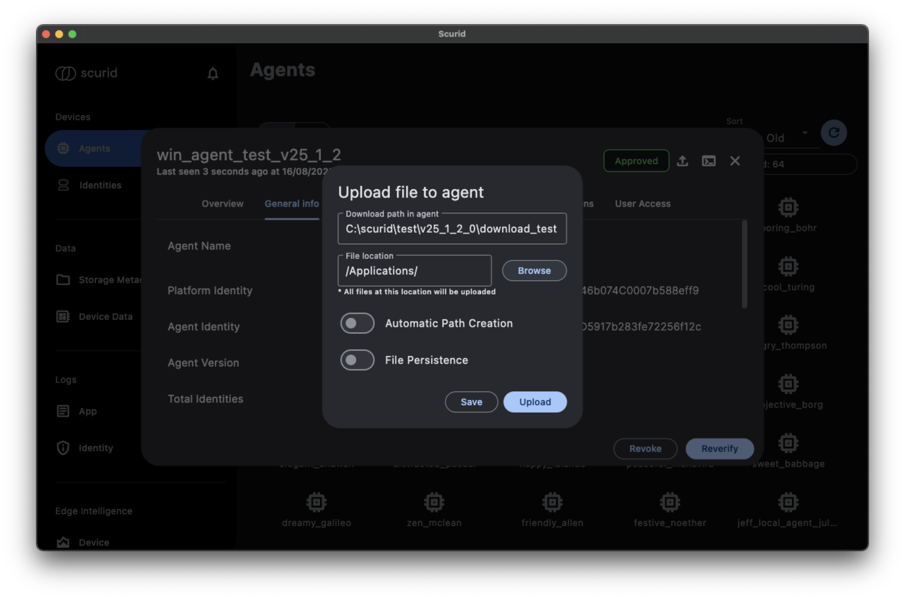
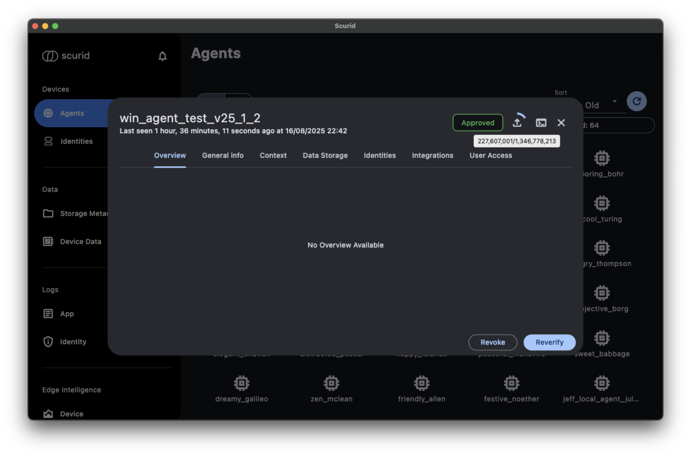

Scurid allows you to manage files on the device, including downloading, uploading, and deleting files. The file management APIs are designed to be simple and efficient, allowing you to interact with files on the device seamlessly.
Scurid Edge Agent will automatically download files from the server to the device, managed through a synchronization rate.

Following options allow you to manage the configuration for the file management:

1. Automatic path creation (default is set to `false`): If the path does not exist, it will be created automatically. This will ensure that the file can be downloaded by the agent on a given path, even if that path does not exist. An error will be logged and visible in the App log, if the path cannot be created.
2. File Persistence (default is set to `false`): If set to `true`, the file will be persisted on the Server and agent will constantly synchronize the file with the server. If set to `false`, the file will be downloaded only once and not synchronized with the server.
3. Download path in agent (`required`): The path where the file will be downloaded on the agent. 
4. File location (`required`): The location of the file on the device from which files are being uploaded using the Scurid App.

!!! note "Current limitations"

    - Subfolders under the selected path are not supported. If they need to be transferred, they must be zipped before.
    - Empty files are not supported.

## Uploading Files
1. Navigate to the agent 
2. Select the appropriate path needed for the upload 
3. As the upload begins, the progress can be tracked both in the logs and also visually in the UI 

## How does the behaviour change with different configurations?

### File Persistence Flag Behaviour
| File Persistence | Description                                                                                                                                                                                                                                                                                        |
|------------------|----------------------------------------------------------------------------------------------------------------------------------------------------------------------------------------------------------------------------------------------------------------------------------------------------|
| Enabled          | Files are stored on the server as long as space is available. The agent can keep files on the specified path and update them when files are re-uploaded to the server. Also if the files are deleted on the device, the agent will re-download those files given they are avaialble on the server. |
| Disabled         | Files are immediately deleted from the server after successful download.                                                                                                                                                                                                                           |

**Tip:** If you want files on the agent to always exist and be updated when files on the server are re-uploaded, enable the File Persistence flag.

!!! note "Known Issues with Unreliable Networks"
    - For highly unreliable networks, it is recommended to enable the File Persistence flag. This ensures that files — especially large ones — are reliably downloaded and not lost due to network interruptions.
    - When the App loses connection during upload, this is not correctly highlighted to the user. Enhancement for this is in progress and due for release with v25.1.2.1.

## File State Handling
- When files are being uploaded, they have the suffix `.upload`. This suffix remains until the Scurid server verifies the file's integrity and then removed.
- When the agent is downloading files, they have the suffix `.download` until the download is successfully completed and then removed.

## File Synchronization
The agent synchronizes files based on hashes generated on the server. This ensures that only changed files are updated, maintaining consistency between the agent and server.

## Handling of File transfer inconsistencies

To ensure data integrity and clear status indication, Scurid uses file suffixes during file transfer operations:

- Files being uploaded are given the `.upload` suffix. This indicates the upload is in progress and not yet completed successfully.
- Files being downloaded are given the `.download` suffix. This indicates the download is in progress and not yet completed successfully.
- These suffixes are automatically removed once the upload or download operation is successfully finished and the file is verified.

This mechanism helps prevent inconsistencies and ensures that only fully transferred files are available for use on the agent or server.
