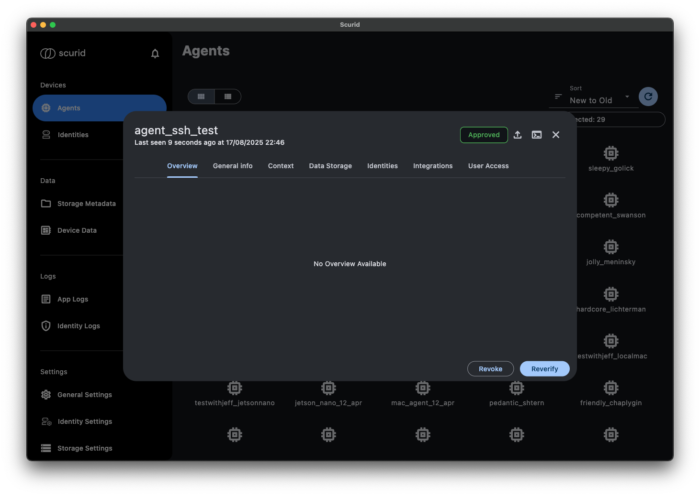

# SSH Feature in Scurid

Scurid provides a built-in SSH feature that can be started directly from the Agent. This capability is native to Scurid and does not rely on any third-party integrations, ensuring a secure and streamlined experience.

## Simplified Connection and Dynamic Ports
- Scurid uses reverse proxy connections on dynamically available ports. Users do not need to worry about which port is chosen; the Scurid app handles this automatically for seamless connectivity.
- Authentication for SSH access is based on the currently logged-in user in the Scurid app, and
- Authentication between the Agent and the Scurid Server is managed via Scurid Identity and the SSH key pair generated by the Agent. This ensures that only authorized and approved Agents can establish SSH connections.

## SSH State Flow
When SSH is requested or stopped, it transitions through the following states:

### When Started
- **Requested**: Indicates that the Agent has received a request to start an SSH connection.
- **Starting**: Negotiations begin between the Scurid Server and the Agent to determine the port and set up reverse SSH.
- **Running**: Negotiations are complete and the SSH connection has been successfully established.

### When Stopping
- **Stopping**: When the user requests to shut down the SSH connection, internal workflows and state updates initiate the shutdown process.
- **Stopped**: The SSH connection is fully closed.

## Security and Control
While users initiate SSH requests from the Agent, it is the Agent that establishes the reverse SSH connection with the server. This approach ensures complete control and security, as the device's IP is never exposed over the internet.

## How to Start an SSH Tunnel
1. Start the Scurid app.
2. Navigate to the Agent card 
3. Ensure that the Agent is online and connected to the Scurid Server. This can be checked on the Agent card which shows the last connection state.
4. Click on the SSH icon at the top; an SSH terminal will open showing the current state. 
5. Once the SSH tunnel is ready, a CLI will be presented to you. 
6. You can close and reopen the agent card without closing the SSH connection.
7. To properly close the SSH connection, click on "Close SSH connection".

## Troubleshooting SSH Connections
- If SSH is taking a while to establish, possible reasons include agent unavailability, the agent being offline, or unstable network connection.
- Simply click on "Close SSH connection" and attempt to reinitiate the connection.
- You can view live notifications of the SSH tunnel status by clicking on the bell notification. This opens a sidebar that updates in real time to show all connection states. 
