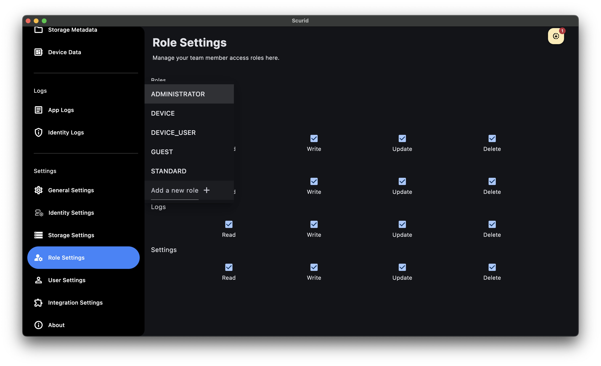
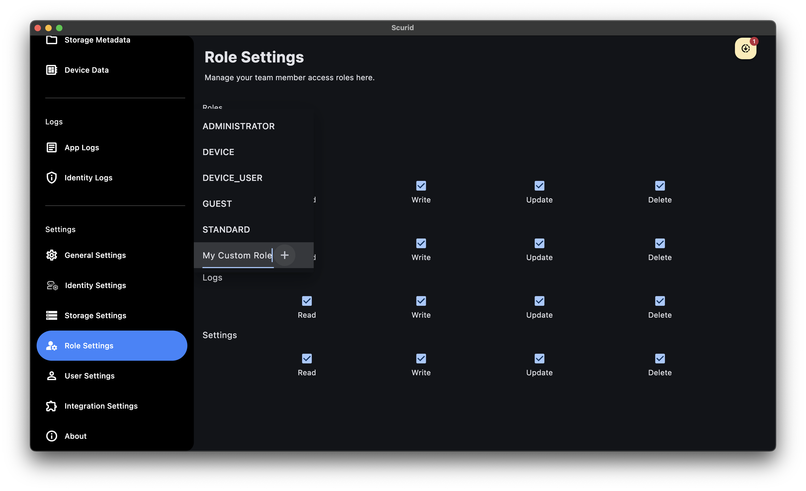
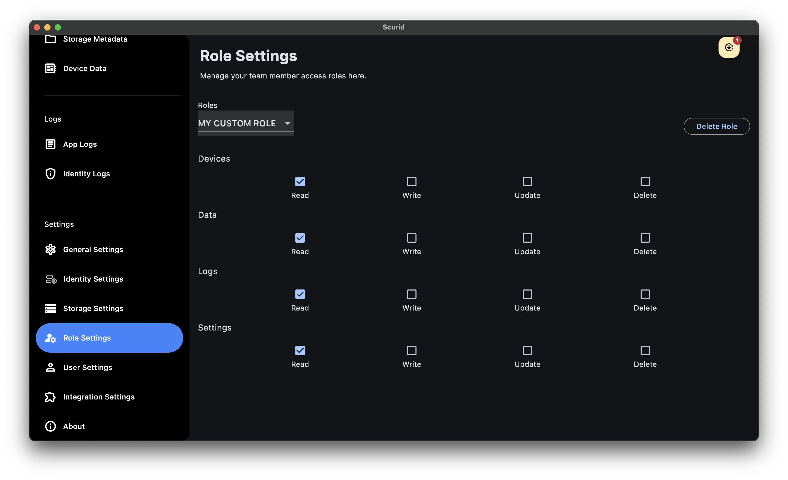

The Scurid App now provides an easy way to create user groups and configure custom roles.

1. Log in to the Scurid App.
2. Navigate to **Role Settings** in the **Settings** menu.
3. View the default roles and their permissions.  
   

## Creating a New Role
1. To add a new role, click the dropdown and select **Add new custom role**.  
   
2. Adjust the access rights for the new role as needed.

!!! info
    
    Default roles cannot be deleted.

## Deleting a Role
1. Select the role you want to delete from the dropdown.
2. Click the **Delete** button.  
   