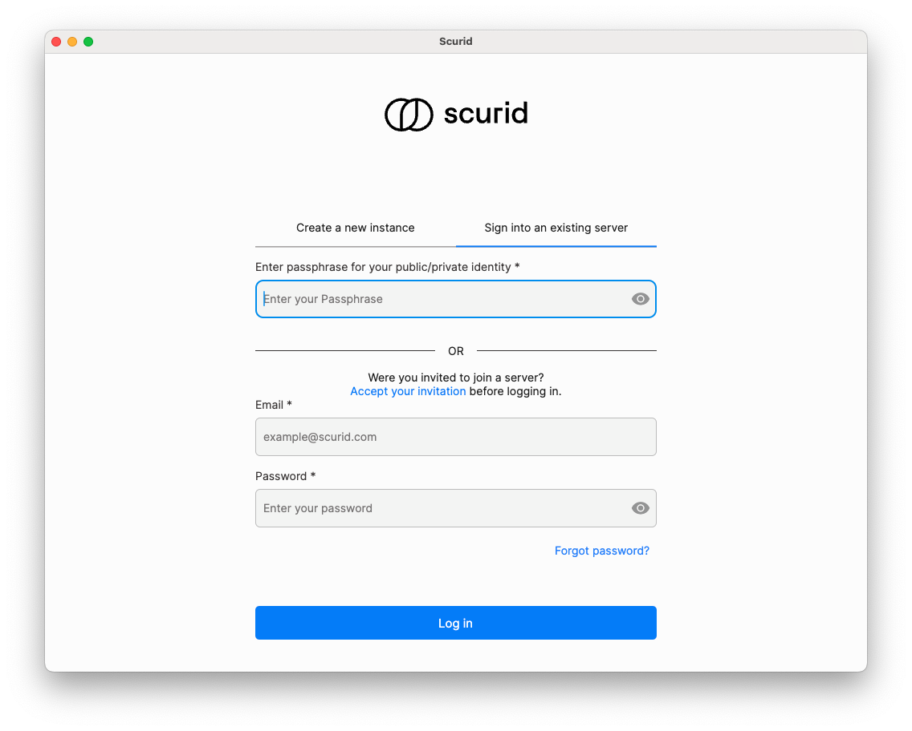
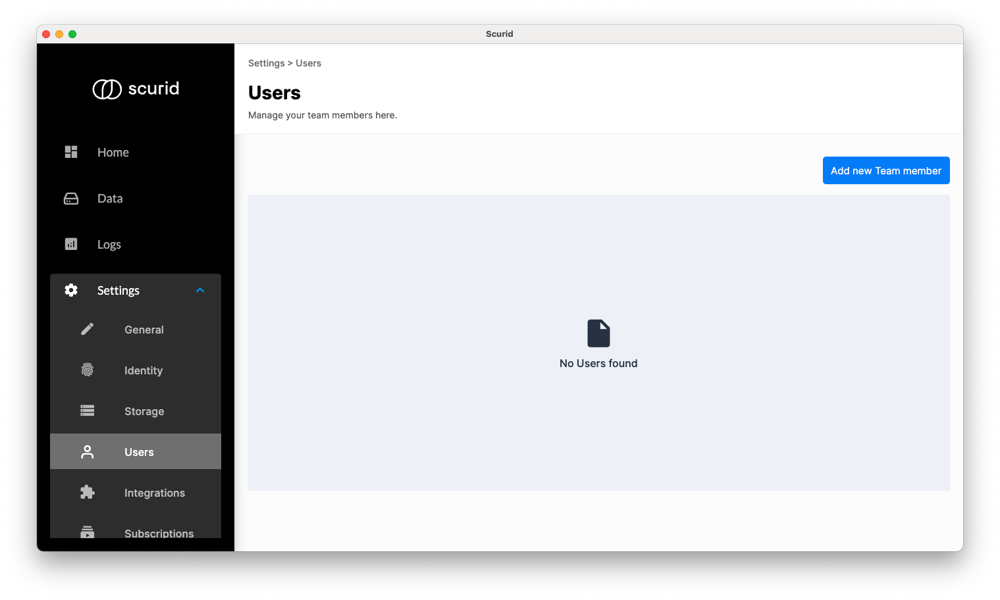
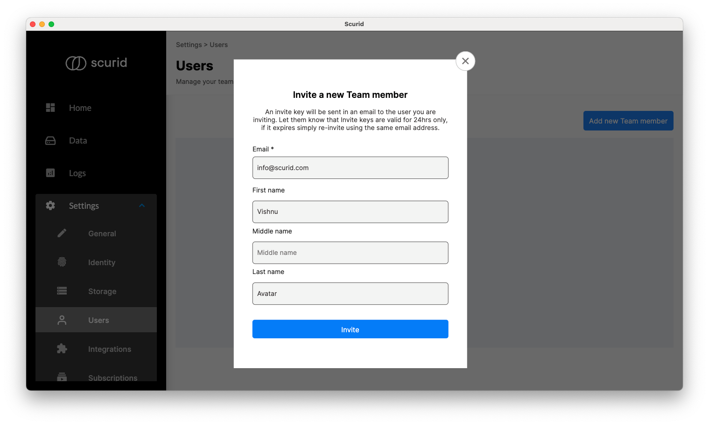
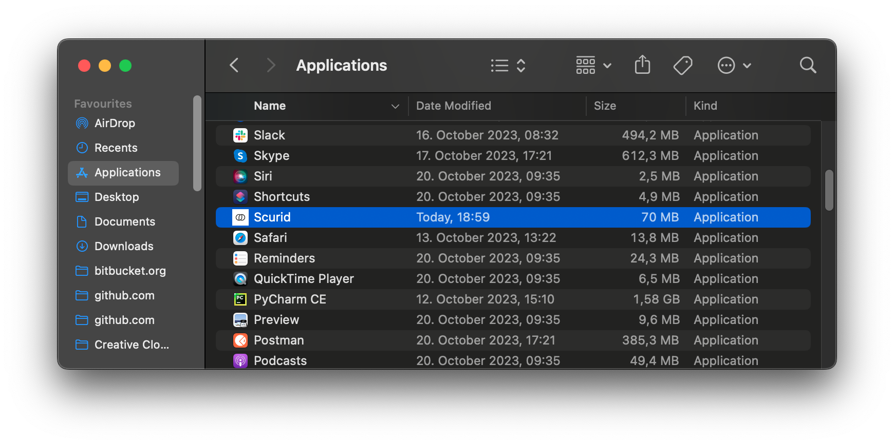
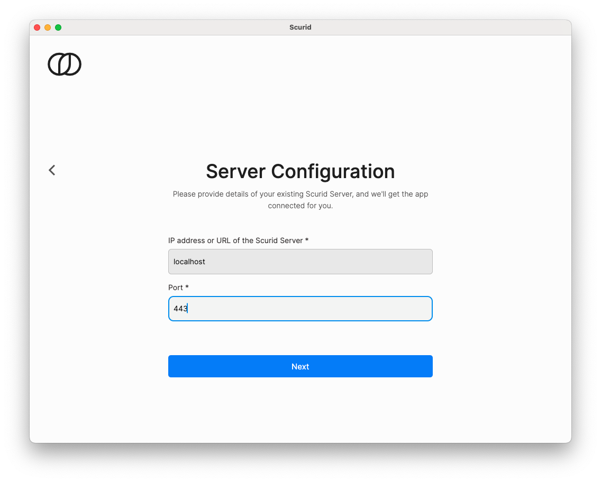
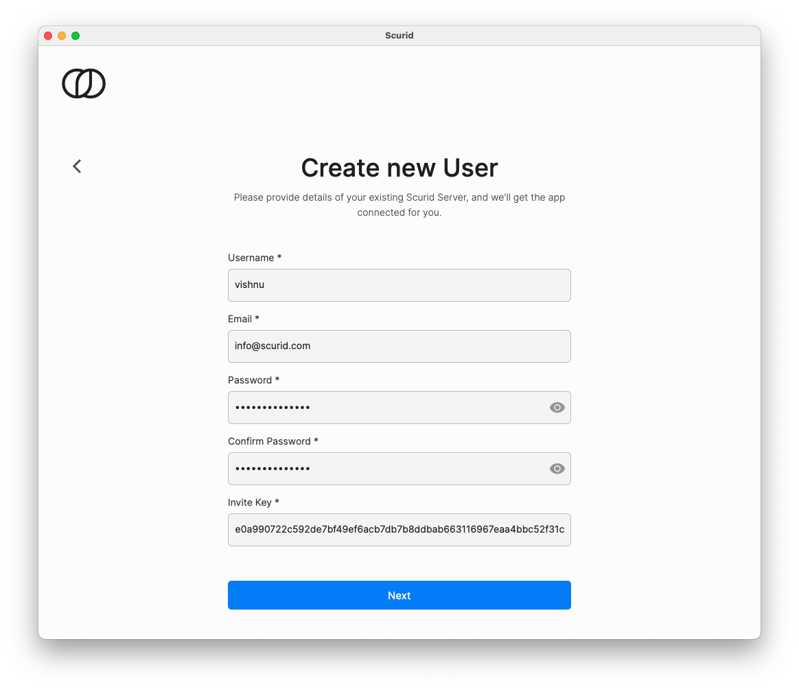
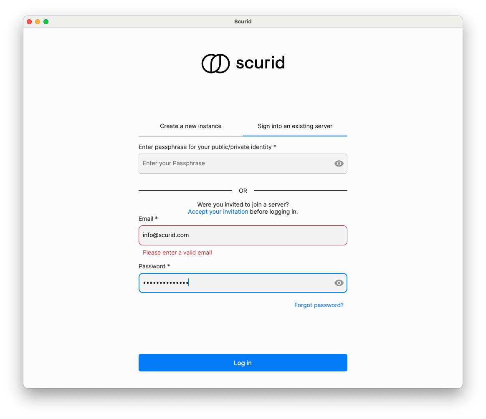

Using Scurid Server and App you can create and invite users in your organization to work with you.

### Pre-requisites
Ensure that you have successfully installed and configured Scurid Server and App.

## Creating and inviting a user
1. Open Scurid App and login with your passphrase created during the onboarding process. 
2. Click on `Settings` then `Users` and click on Add new user. 
3. Fill in the required details and click on `Invite`. 
4. The user will receive an email with an invite code valid for 24hrs. If the user fails to complete the invitation process within 24hrs, you can resend the invite code by filling up the invite form.

## Accepting an invite
1. Download the app from [Downloads](https://scurid.com/downloads)
2. Launch the app and toggle to `Sign into an existing server`
3. Click on 
4. Enter the server and port your were invited to and click on `Next`. 
5. Complete the form, including the invite code you received in your email and click on `Next`. 
6. Once done, app will reload to show the login page. Click on `Sign into an existing server` and login with your email and password you just created. 
