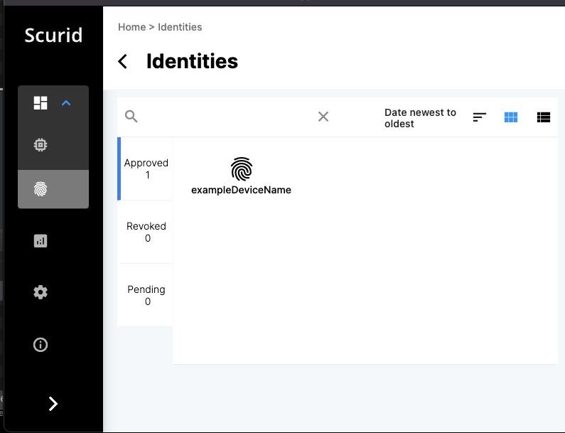

 <span style="color:gray">Author: Reishi Mitani, Software engineer, Intern </span>.

This tutorial provides a simplified overview on generating, approving device identity with the microscurid-c library, and approving it using Scurid App.

## Initial setup & pre-requisite

Before starting ensure that one time user on-boarding has been finished with Scurid. See the [quickstart guide.](quickstart-on-premise.md) 

Use the example code in the microscurid-c library available [here](https://github.com/scurid-inc/microscurid-c/tags) for download.

## 1. About the server and microscurid-c code

For an on-premise deployment Scurid app, server and microscurid-c will be needed.

- Run the Scurid server binary supported on platforms `MacOs`, `Linux`, or `Windows` . Make sure to have the specific port (in this tutorial, `8888`) open so that the MCU can make requests to the server. Download the server from [here](https://drive.google.com/drive/folders/1nuMr7S9HYsjOBsEJQoDYTbnwi1I4uPiB)
- The microscurid-c library currently works on the `STM32WB55` series. Another adapter to connect to the ethernet may be needed as well. Download the microscurid-c code [here](https://github.com/scurid-inc/microscurid-c/tags)
- The Scurid App will be used for approving the registration requests of identities from the MCU. Download the Scurid App [here](https://drive.google.com/drive/folders/1nuMr7S9HYsjOBsEJQoDYTbnwi1I4uPiB)

## 2. Preparation on the MCU : configuring the network info

We will open the example code of the microscurid-c library in the `STM32 Cube IDE`.
Download the STM32 Cube IDE [here](https://www.st.com/en/development-tools/stm32cubeide.html)

### 1. Configure the network

Before compiling and transferring the example code to our MCU, we first need to configure the network settings. In `app_freertos.c`, configure the server port and IP address as below.

```c
#define BACKEND_SERVER_PORT 8888
...
unsigned char BACKEND_SERVER_IP[4] = {192,168,151,128};
```

We will also need to configure the subnet mask and gateway server IP address, and whether we want to enable DHCP.

```c
static wiz_NetInfo g_net_info = { .mac = { 0x00, 0x00, 0x00, 0x00, 0x00, 0x00 },// MAC address, we fill them with zeros since they are unnecessary for now
		.ip = { 192, 168, 151, 127 },                    // // IP address, fill in random numbers if using DHCP
		.sn = { 255, 255, 254, 0 },                    	// Subnet Mask
		.gw = { 192, 168, 150, 1 },                     // Gateway
		.dns = { 192, 168, 150, 1 },                    // DNS server
		.dhcp = NETINFO_DHCP                       	// DHCP enable/disable
		};
```

### 2. Paste your certificate

We also need to paste the certificate, which is to be used for encryption in `Drivers/TLS/certificate.h`.

We'll use the subordinate ca certificate generate from Scurid for this blog.

```c

const char	self_signed_certificate[] =	\
"-----BEGIN CERTIFICATE-----\n" \
"MIIGTjCCBDagAwIBAgIUAKvvmZw3VLawhM9mvTKFJubPj78wDQYJKoZIhvcNAQEL\n" \
"BQAwZDELMAkGA1UEBhMCanAxDjAMBgNVBAgTBXRva3lvMQ4wDAYDVQQHEwV0b2t5\n" \
"...\n" \
"bzEPMA0GA1UEChMGc2N1cmlkMQ8wDQYDVQQLEwZzY3VyaWQxEzARBgNVBAMTCnNj\n" \
"dXJpZC5jb20wHhcNMjIwOTI4MDQyODQ2WhcNMzExMjI4MjA0NTUxWjBkMQswCQYD\n" \
"D+mhQS2JfxyOjx2RmiJUqTCJRBvSTk0DfMItaFxV+BJ5nA==\n" \
"-----END CERTIFICATE-----\n";

```

### 3. Fix the conflict between macros.

There may also be some conflicts between the `W5500` and `STM32` library.
Modify `MR` => `W_MR` in the `/p-nucleo-wb55/Middlewares/ioLibrary_Driver/Ethernet/W5500/w5500.h`.

```c
#define W_MR                 (_W5500_IO_BASE_ + (0x0000 << 8) + (WIZCHIP_CREG_BLOCK << 3))

// ...............

/////////////////////////////////
// Common Register I/O function //
/////////////////////////////////
/**
 * @ingroup Common_register_access_function
 * @brief Set Mode Register
 * @param (uint8_t)mr The value to be set.
 * @sa getMR()
 */
#define setMR(mr) \
	WIZCHIP_WRITE(W_MR,mr)


/**
 * @ingroup Common_register_access_function
 * @brief Get Mode Register
 * @return uint8_t. The value of Mode register.
 * @sa setMR()
 */
#define getMR() \
		WIZCHIP_READ(W_MR)
```

### 4. Ensure Cube IDE access to the library

In `properties -> C/C++ Build -> Settings`, check the following

- the middlewares and their search paths are configured correctly in `MCU GCC Compiler -> Include Paths` 
- the microscurid library and their search paths are configured correctly in `MCU GCC Linker -> Libraries`

### 5. Configuring the RTC timer

The RTC timer must be configured to provide an accurate timestamp. Configure them here in: `microscurid-c/examples/p-nucleo-wb55/Core/Src/main.c`

```c
sTime.Hours = 0x11;
sTime.Minutes = 0x32;
sTime.Seconds = 0x0;
sTime.SubSeconds = 0x0;
sTime.DayLightSaving = RTC_DAYLIGHTSAVING_NONE;
sTime.StoreOperation = RTC_STOREOPERATION_RESET;
if (HAL_RTC_SetTime(&hrtc, &sTime, RTC_FORMAT_BCD) != HAL_OK)
{
    Error_Handler();
}
sDate.WeekDay = RTC_WEEKDAY_SATURDAY;
sDate.Month = RTC_MONTH_NOVEMBER;
sDate.Date = 0x26;
sDate.Year = 0x2022;
```

## 2. Preparation on the server and the Scurid App

Before running the server, we need to fill in our certificate info in `config.yaml`.
Make sure to fill in all the required fields. The code below is an example with all the required fields filled in.

```yaml
ServerCert:
  CommonName: localhost
  Country: JP
  Province: Tokyo
  Locality: Tokyo
  Organization: ScuridInc.
  OrganizationalUnit: Software Team
  EmailAddress: info@scurid.com
  LifetimeDays: 730 # default 2 years, minimum 1 month, maximum 10 years
```

Launch the server if config provided correctly you may see following log.

```shell
$ ./imagebuild/service-v22.0.1-alpha.0-darwin
2022-12-18 00:20:27.000 DBG connected to Scurid SSI Service xxx.scurid.com:443
2022-12-18 00:20:27.000 DBG found path for store
...
2022-12-18 00:20:29.000 INF License is activated!

```

Next open the Scurid App. The App should open the following page:

{ width=400 }

Choose any directory for the storage.
Next, we fill in the user info.

{ width=400 }

Finally, we set up the master password (for the beta version, please be careful as there is no password reset feature, yet).

{ width=400 }

We can skip configuring the storage for now.

{ width=400 }

We are finally done with the on-boarding for Scurid App! Congrats!

{ width=400 }

The following files will be created in the storage directory we chose in the on-boarding. DO NOT manually edit / move these files.

```shell
000001.vlog
DISCARD
00001.mem
KEYREGISTRY
MANIFEST
LOCK
```

## 3. Generate and send the identity request from MCU

It is time to run the example code on the MCU.
Click the run icon on the IDE.

It takes about 3 minutes to establish the TLS connection and send the identity over to the server.

## 4. Approving the MCU identity on the Scurid App

Once the data is sent via the TLS connection, you can approve the device on the Scurid App.

Login to the Scurid App and open the `Identities` tab.
Inside the `Identities` tab, open the `Pending` tab.
You should see a pending identity, if it was sent properly to the server.

{ width=400 }

Each identity is bound to its underlying hardware, click on the pending device identity & click approve at the bottom of the identity card.

{ width=400 }

The approval process takes a few seconds to register the transaction on Scurid SSI service, which in turns registers the data on distributed ledger.

{ width=400 }

When the approval is done, you should be able to see confirmation on the Scurid App for respective identity.
Click anywhere outside the modal to exit.

{ width=400 }

The approved identity will appear in the `Approved` tab.

{ width=400 }

That's it your microcontroller is now ready with an unique digital identity which be used for authentication and authorization with any IoT/IIoT Platform.