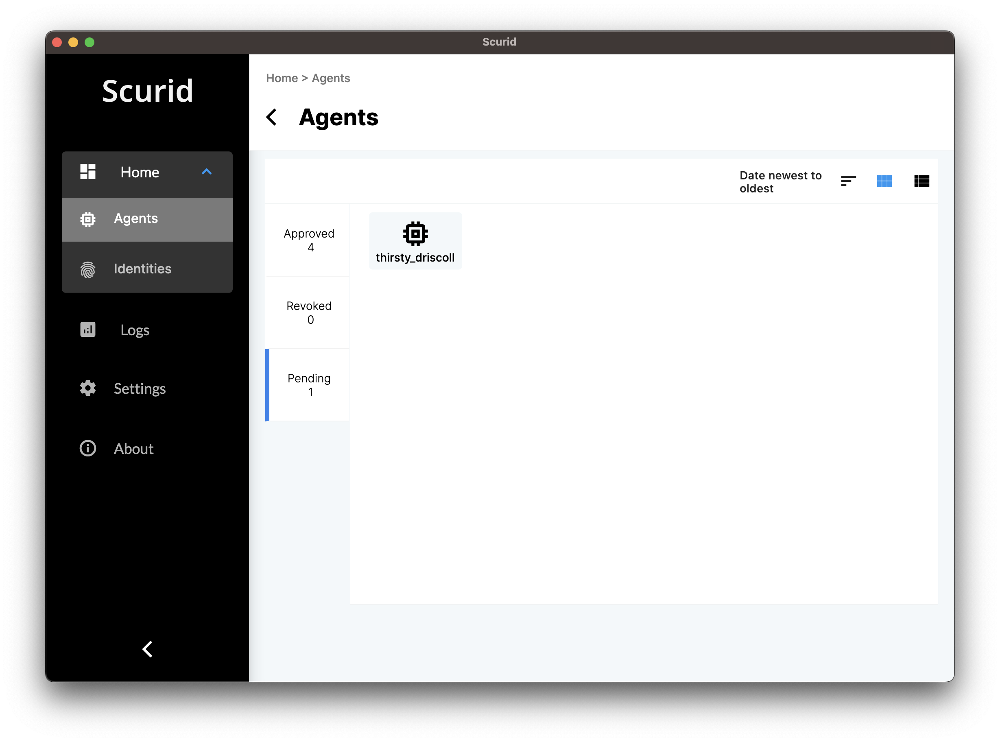
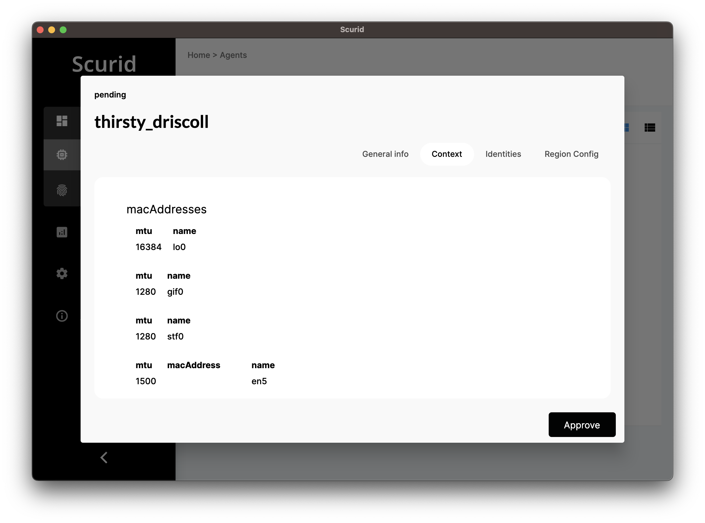
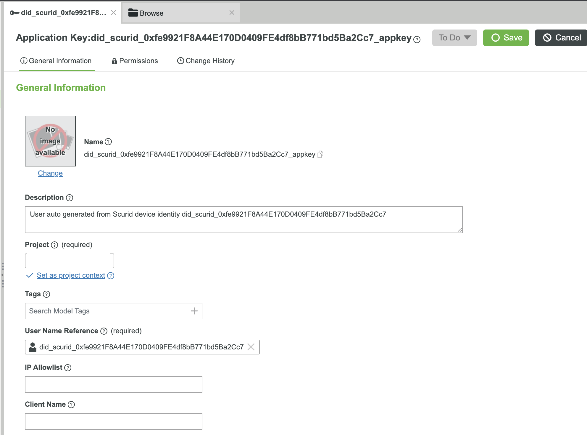

This page describes how Scurid integrates, adds and support out of the box authentication and authorization mechanism of PTC's ThingWorx, an IIoT Platform.

Integrating Scurid's distributed digital identity with ThingWorx is straight forward, it does not require any external plugins to be imported or any kind of extension creation for ThingWorx.

!!! tip "No strip & replace"
    Scurid's integration does not strip & replace ThingWorx's standard ways of functioning, rather it adds as a security layer to the existing digital identity mechanism in ThingWorx.

## Key highlights
* Drastically reduce the time to onboard new devices. 
* Secure with low touch, low configuration requirements.
* Reducing/removing the "man-in-the-middle" attack vector.
* Removes fixed credentials usage if you are building custom mechanism (like `bash` scripts etc.) to distribute Application Key to the Edge devices. 
* Removing the manual effort that's needed to deliver ThingWorx's primary authentication mechanism [Application Key](https://support.ptc.com/help/thingworx/platform/r9/en/index.html#page/ThingWorx/Help/Composer/Security/ApplicationKeys/ApplicationKeys.html) to the edge devices.
* Scurid does not create / assign access rights/permissions within ThingWorx, allowing you complete control on what access rights to be assigned to these new users and application keys.
* All communication happens over TLS.


## Scope and use 

This integration is for users who :

* Already have or are planning to deploy ThingWorx IIoT Platform.
* Using ThingWorx's Edge SDK like `ThingWorx Edge Java SDK` , `ThingWorx Edge C SDK`, etc. to connect and collect data from IoT Edge Devices , this integration also supports if you have any custom connector e.g. REST based connector written in `Python`, etc.. 
* Creating and delivering ThingWorx based `Application Keys` to the IoT Edge Devices in order to identify and authenticate devices with the ThingWorx Server.

## Pre-requisites

* Have a running ThingWorx Server and be ready with following :
  * ThingWorx Server and port information e.g. `https://localhost:443/Thingworx`
  * Created `Application Key` in ThingWorx having enough rights to create following Entities in ThingWorx
    * [Things](https://support.ptc.com/help/thingworx/platform/r9/en/index.html#page/ThingWorx/Help/Composer/Things/Things.html)
    * [User](https://support.ptc.com/help/thingworx/platform/r9/en/index.html#page/ThingWorx/Help/Composer/Security/Users/Users.html)
    * [Application Key](https://support.ptc.com/help/thingworx/platform/r9/en/index.html#page/ThingWorx/Help/Composer/Security/ApplicationKeys/ApplicationKeys.html)
* Have installed and completed Scurid installation & on-boarding, see [Quickstart](quickstart-on-premise.md) guide

## Enabling ThingWorx with Scurid's Digital Identity

### Step 1: Configure ThingWorx server information in Scurid 
Provide Server Address with port & Application Key to your locally installed Scurid App. Using this Scurid will establish REST API connection to create User and Application Key when a new device identity is approved on Scurid.

### Step 2: Install and run Scurid Edge agent 
Scurid Edge agent is a small client designed to work on variety of edge platforms. Run Scurid Edge Agent with flag `-twxreg true`.

```shell
$ ./scuridedgeagent-linux-arm7 -spaaddr <scuridServerAddress>:443 -twxreg true
```

!!! note
    `-twxreg` flag is `false` by default.

Scurid Edge Agent will perform following automated tasks

   1. Create new digital identity wallet on the device 
   2. Create new distributed digital identity
   3. Encrypts and store its private key on the device 
   4. Collects required device context which is made up of different kind of hardware information like
      1. Information about OS & RAM
      2. MAC addresses, etc. 
      3. This device context is bundled together with the public key, created in step 2, then sent to the Scurid App, this is visible in `Home > Agents > Pending` 
        a. Click on the Pending identity to see the Public ID,   
        b. Switch to `Device Context` to see hardware information 
      4. Scurid Edge Agent will wait for the Approval from the user on Scurid App
   5. To approve an agent's identity navigate to the `Home > Agents > Pending > Click on the Pending Agent > Click Approve` . 

      Approving the Agent/Device's identity will trigger following automated events :

      * Registering an identity in Scurid will trigger transaction on Scurid hosted distributed ledger under Scurid SSI Service.
      * Generation of Approval signature, by signing the request from the Scurid Edge Agent, its device context, timestamps
      * Next, Scurid server will trigger the request to ThingWorx to :
        * Create New User, using the public key/public ID of the Scurid Edge Agent 
        * Create New Application Key, referencing the user from previous step 
   6. Approval Key from the `Parent identity`, which belongs to you when you installed Scurid stack - this automatically gets created 
   7. Agent's own identity and some other contextual information like approval date etc. 

### Step 3: Access ThingWorx Application Key on the Edge 

Finally, Scurid Server will package the `Approval Signature` & ThingWorx's `Application Key` and send it to the Scurid Edge Agent running on your IoT Edge device to complete the device's digital identity on-boarding and transfer of ThingWorx `Application Key` to the device and ready to be used by ThingWorx Edge SDK software running on this device.
    