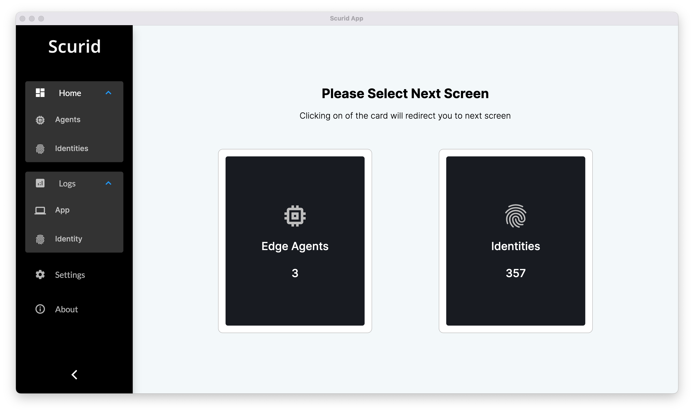
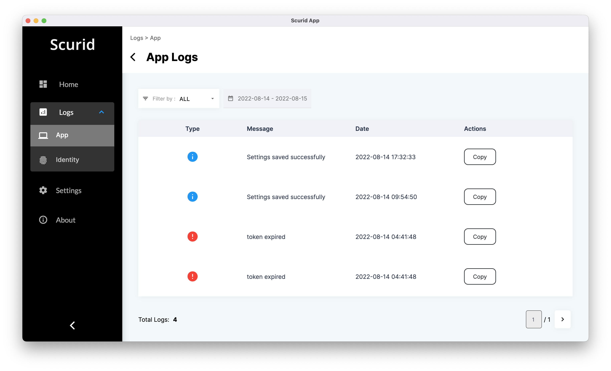
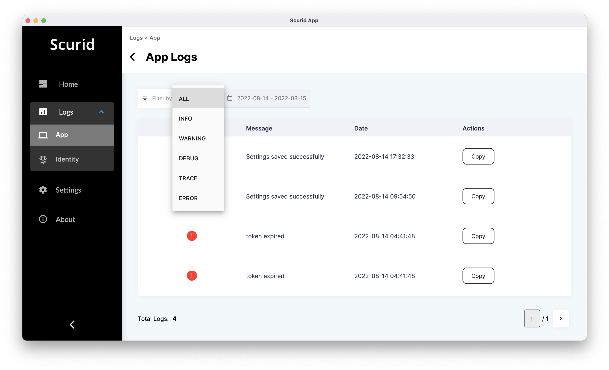
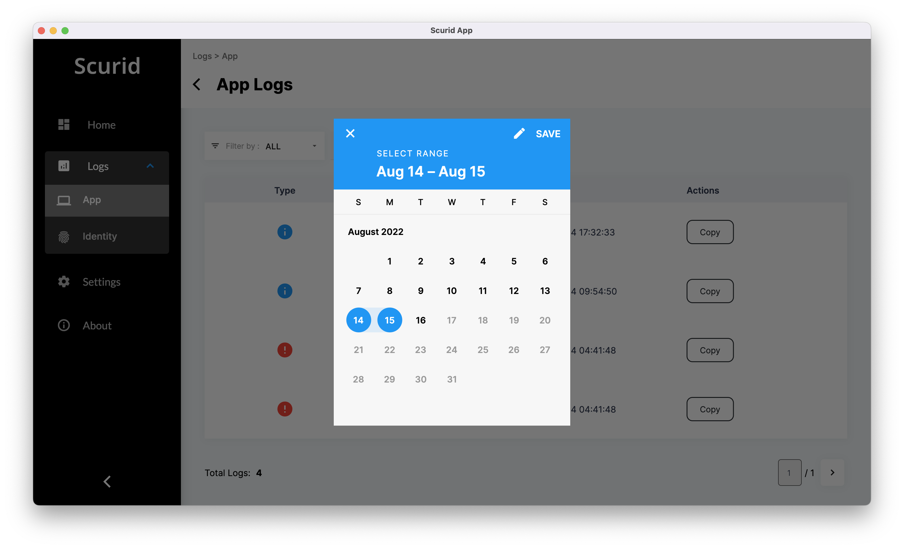
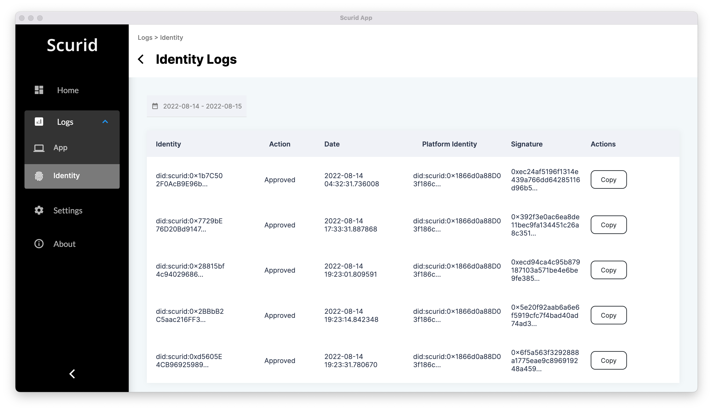

Like any other application, logging is an essential part within Scurid. It is also given special attention when it comes to logging critical operations on the identity, e.g. approving, rejecting, etc. an identity  

Logs are delivered right within the app and are stored in the Scurid Backend. In addition to logging critical operations, they are also signed and can be verified on demand to prevent any kind of tampering.

Logs are divided into two major categories :
* Application (App) log, which is essentially set of operational records of the Scurid Platform App application
* Identity log, which is specifically recorded as user or as backend automates the identity workflow processing

## Access App Logs

1. Launch the app, and access the Logs menu from the left 
2. Click on the App Log 
3. App Logs are categorized under following log levels 
4. Log are automatically filtered with moving 24hours window which can be adjusted from the datetime widget 

## Access Identity Logs
1. Launch the app, and access the Logs menu from the left 
2. Click on the Identity option under Logs menu to list identity logs from 24hrs 
3. Using the date time widget, log range can be adjusted 
4. Identity log contains all the identity workflow action performed on the identity. Each of these actions are signed using the Platform identity, which is the unique identity bound to each customer's deployment of Scurid backend.
5. This also means, this makes identity logs tamper evident out of the box, without any special configuration! 