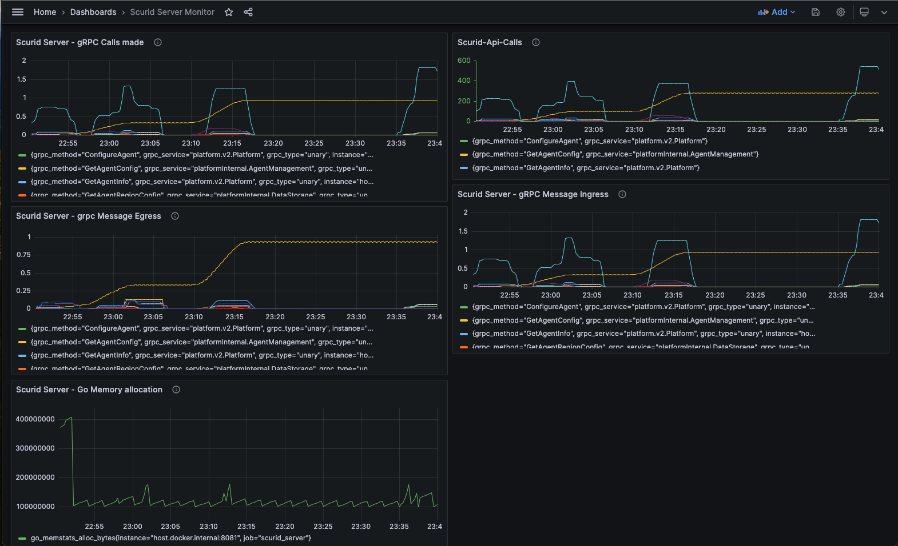

Scurid server exposes metrics in  [Prometheus](https://prometheus.io/) format at the `/metrics` endpoint. The metrics are collected by Prometheus server at regular intervals. Server uses `config.yaml` file to configure the port and address. 
These metrics can easily be visualized using tools like [Grafana](https://grafana.com/).

By default, the port and the address is set to in the `config.yaml` file. This is the default configuration for Scurid server on which the metrics are exposed.

```yaml
Monitoring:
    Port: 8081 #default
    Address: localhost #default
```

If you have already installed and have Scurid Server running with default configuration you can access the metrics at `http://localhost:8081/metrics`. Otherwise, you can change the port and address in `config.yaml` file and restart the server.

## Accessing Server Metrics
Prometheus server is deployed separately within your infrastructure, and it scrapes the metrics exposed by Scurid server.

If you don't have it already running you can use the docker image to start the server locally.

### Starting Prometheus Server
Prometheus server can be started using docker image. Following example shows how to start Prometheus server using docker image with a configuration file.

#### Prometheus Configuration File
```yaml
global:
  scrape_interval:     15s # Set the scrape interval to every 15 seconds. Default is every 1 minute.
  evaluation_interval: 15s # Evaluate rules every 15 seconds. The default is every 1 minute.

scrape_configs:
  - job_name: 'scurid_server'
    static_configs:
      - targets: ['host.docker.internal:8081']

```

#### Using docker to start the prometheus server


```shell 

# Use an official Prometheus image as base image
FROM prom/prometheus

# Copy the Prometheus configuration file into the Docker image
COPY prometheus.yaml /etc/prometheus/

# Set the command to start Prometheus with this configuration file
CMD [ "--config.file=/etc/prometheus/prometheus.yaml" ]

```


### Visualizing Metrics with Grafana
Next, let's get the Grafana dashboard up and running. Grafana is a visualization tool that can be used to visualize the metrics collected by Prometheus server.

### Starting or installing Grafana
If you are installing Grafana for the first time, visit [Grafana download page](https://grafana.com/grafana/download) and follow the instructions to install Grafana on your system.

### Configure Data Source in Grafana
Once you have Grafana running, you can configure the Prometheus server as a data source.

1. Open Grafana in your browser and login .
2. Click on the `Connections` icon on the left sidebar and select `Data Sources`.
3. Click on `Add data source` and select `Prometheus` from the list.
4. Enter the URL of the Prometheus server in the `URL` field. If you are running Prometheus server locally, you can use `http://localhost:9090`.
5. Click on `Save & Test` to save the data source.
6. You should see a success message if the data source is configured correctly.
7. Click on `Dashboards` icon on the left sidebar and New, then select `Import`.
8. On the `Import Dashboard` page, copy the contents from the section below `Pre-configured Dashboard JSON` and paste it in the `Import via panel json` field. 
9. Click on `Load`, select Prometheus data source and then `Import` to import the dashboard.
10. You should see the dashboard with the metrics .


### Pre-configured Dashboard JSON

Provides a preconfigured dashboard for Scurid Server monitoring.

```json
{
  "__inputs": [
    {
      "name": "DS_SCURID_SERVER MONITORING",
      "label": "Scurid Server Monitoring",
      "description": "",
      "type": "datasource",
      "pluginId": "prometheus",
      "pluginName": "Prometheus"
    }
  ],
  "__elements": {},
  "__requires": [
    {
      "type": "panel",
      "id": "dashlist",
      "name": "Dashboard list",
      "version": ""
    },
    {
      "type": "grafana",
      "id": "grafana",
      "name": "Grafana",
      "version": "10.0.2"
    },
    {
      "type": "datasource",
      "id": "prometheus",
      "name": "Prometheus",
      "version": "1.0.0"
    },
    {
      "type": "panel",
      "id": "timeseries",
      "name": "Time series",
      "version": ""
    }
  ],
  "annotations": {
    "list": [
      {
        "builtIn": 1,
        "datasource": {
          "type": "grafana",
          "uid": "-- Grafana --"
        },
        "enable": true,
        "hide": true,
        "iconColor": "rgba(0, 211, 255, 1)",
        "name": "Annotations & Alerts",
        "type": "dashboard"
      }
    ]
  },
  "editable": true,
  "fiscalYearStartMonth": 0,
  "graphTooltip": 0,
  "id": null,
  "links": [],
  "liveNow": true,
  "panels": [
    {
      "datasource": {
        "type": "prometheus",
        "uid": "${DS_SCURID_SERVER MONITORING}"
      },
      "description": "grpc_server_started_total is a counter metric provided by the grpc_prometheus Go package that gets incremented every time a gRPC server RPC operation is started. This can be useful to track the total number of RPC calls made to your server, or the rate at which RPC calls are being made.",
      "fieldConfig": {
        "defaults": {
          "color": {
            "mode": "palette-classic"
          },
          "custom": {
            "axisCenteredZero": false,
            "axisColorMode": "text",
            "axisLabel": "",
            "axisPlacement": "auto",
            "barAlignment": 0,
            "drawStyle": "line",
            "fillOpacity": 0,
            "gradientMode": "none",
            "hideFrom": {
              "legend": false,
              "tooltip": false,
              "viz": false
            },
            "lineInterpolation": "linear",
            "lineWidth": 1,
            "pointSize": 5,
            "scaleDistribution": {
              "type": "linear"
            },
            "showPoints": "auto",
            "spanNulls": false,
            "stacking": {
              "group": "A",
              "mode": "none"
            },
            "thresholdsStyle": {
              "mode": "off"
            }
          },
          "mappings": [],
          "thresholds": {
            "mode": "absolute",
            "steps": [
              {
                "color": "green",
                "value": null
              },
              {
                "color": "red",
                "value": 80
              }
            ]
          }
        },
        "overrides": []
      },
      "gridPos": {
        "h": 8,
        "w": 12,
        "x": 0,
        "y": 0
      },
      "id": 123128,
      "options": {
        "legend": {
          "calcs": [],
          "displayMode": "list",
          "placement": "bottom",
          "showLegend": true
        },
        "tooltip": {
          "mode": "single",
          "sort": "none"
        }
      },
      "targets": [
        {
          "datasource": {
            "type": "prometheus",
            "uid": "${DS_SCURID_SERVER MONITORING}"
          },
          "editorMode": "code",
          "expr": "rate(grpc_server_started_total{job=\"scurid_server\"}[5m])",
          "instant": false,
          "range": true,
          "refId": "A"
        }
      ],
      "title": "Scurid Server - gRPC Calls made",
      "type": "timeseries"
    },
    {
      "datasource": {
        "type": "prometheus",
        "uid": "${DS_SCURID_SERVER MONITORING}"
      },
      "description": "This query will calculate the increase in the grpc_server_handled_total metric over the last 5 minutes, grouped by method and service. It'll give you a rough idea of the QPS (queries per second) for each gRPC method.",
      "fieldConfig": {
        "defaults": {
          "color": {
            "mode": "palette-classic"
          },
          "custom": {
            "axisCenteredZero": false,
            "axisColorMode": "series",
            "axisGridShow": false,
            "axisLabel": "",
            "axisPlacement": "auto",
            "barAlignment": 0,
            "drawStyle": "line",
            "fillOpacity": 0,
            "gradientMode": "none",
            "hideFrom": {
              "legend": false,
              "tooltip": false,
              "viz": false
            },
            "lineInterpolation": "smooth",
            "lineWidth": 1,
            "pointSize": 5,
            "scaleDistribution": {
              "type": "linear"
            },
            "showPoints": "auto",
            "spanNulls": false,
            "stacking": {
              "group": "A",
              "mode": "none"
            },
            "thresholdsStyle": {
              "mode": "off"
            }
          },
          "mappings": [],
          "thresholds": {
            "mode": "absolute",
            "steps": [
              {
                "color": "green",
                "value": null
              },
              {
                "color": "red",
                "value": 80
              }
            ]
          }
        },
        "overrides": []
      },
      "gridPos": {
        "h": 7,
        "w": 12,
        "x": 12,
        "y": 0
      },
      "id": 123124,
      "options": {
        "legend": {
          "calcs": [],
          "displayMode": "list",
          "placement": "bottom",
          "showLegend": true
        },
        "tooltip": {
          "mode": "single",
          "sort": "none"
        }
      },
      "targets": [
        {
          "datasource": {
            "type": "prometheus",
            "uid": "${DS_SCURID_SERVER MONITORING}"
          },
          "editorMode": "code",
          "expr": "sum by (grpc_method, grpc_service) (increase(grpc_server_handled_total[5m]))",
          "instant": false,
          "range": true,
          "refId": "A"
        }
      ],
      "title": "Scurid-Api-Calls",
      "type": "timeseries"
    },
    {
      "datasource": {
        "type": "prometheus",
        "uid": "${DS_SCURID_SERVER MONITORING}"
      },
      "description": "This is a counter metric that gets incremented every time a gRPC server receives a message.The counter itself only increases over time, but by taking the rate over a time window, you can see how many messages are received per unit of time.",
      "fieldConfig": {
        "defaults": {
          "color": {
            "mode": "palette-classic"
          },
          "custom": {
            "axisCenteredZero": false,
            "axisColorMode": "text",
            "axisLabel": "",
            "axisPlacement": "auto",
            "barAlignment": 0,
            "drawStyle": "line",
            "fillOpacity": 0,
            "gradientMode": "none",
            "hideFrom": {
              "legend": false,
              "tooltip": false,
              "viz": false
            },
            "lineInterpolation": "linear",
            "lineWidth": 1,
            "pointSize": 5,
            "scaleDistribution": {
              "type": "linear"
            },
            "showPoints": "auto",
            "spanNulls": false,
            "stacking": {
              "group": "A",
              "mode": "none"
            },
            "thresholdsStyle": {
              "mode": "off"
            }
          },
          "mappings": [],
          "thresholds": {
            "mode": "absolute",
            "steps": [
              {
                "color": "green",
                "value": null
              },
              {
                "color": "red",
                "value": 80
              }
            ]
          }
        },
        "overrides": []
      },
      "gridPos": {
        "h": 8,
        "w": 12,
        "x": 12,
        "y": 7
      },
      "id": 123126,
      "options": {
        "legend": {
          "calcs": [],
          "displayMode": "list",
          "placement": "bottom",
          "showLegend": true
        },
        "tooltip": {
          "mode": "single",
          "sort": "none"
        }
      },
      "targets": [
        {
          "datasource": {
            "type": "prometheus",
            "uid": "${DS_SCURID_SERVER MONITORING}"
          },
          "editorMode": "code",
          "expr": "rate(grpc_server_msg_received_total{job=\"scurid_server\"}[5m])",
          "instant": false,
          "range": true,
          "refId": "A"
        }
      ],
      "title": "Scurid Server - gRPC Message Ingress",
      "type": "timeseries"
    },
    {
      "datasource": {
        "type": "prometheus",
        "uid": "${DS_SCURID_SERVER MONITORING}"
      },
      "description": "is a counter metric that gets incremented every time a gRPC server sends a message. Just like grpc_server_msg_received_total, this metric is also provided by the grpc_prometheus Go package.\n\nThis metric can be useful for visualizing the rate at which your gRPC server is sending messages.",
      "fieldConfig": {
        "defaults": {
          "color": {
            "mode": "palette-classic"
          },
          "custom": {
            "axisCenteredZero": false,
            "axisColorMode": "text",
            "axisLabel": "",
            "axisPlacement": "auto",
            "barAlignment": 0,
            "drawStyle": "line",
            "fillOpacity": 0,
            "gradientMode": "none",
            "hideFrom": {
              "legend": false,
              "tooltip": false,
              "viz": false
            },
            "lineInterpolation": "smooth",
            "lineWidth": 1,
            "pointSize": 5,
            "scaleDistribution": {
              "type": "linear"
            },
            "showPoints": "auto",
            "spanNulls": false,
            "stacking": {
              "group": "A",
              "mode": "none"
            },
            "thresholdsStyle": {
              "mode": "off"
            }
          },
          "mappings": [],
          "thresholds": {
            "mode": "absolute",
            "steps": [
              {
                "color": "green",
                "value": null
              },
              {
                "color": "red",
                "value": 80
              }
            ]
          }
        },
        "overrides": []
      },
      "gridPos": {
        "h": 8,
        "w": 12,
        "x": 0,
        "y": 8
      },
      "id": 123127,
      "options": {
        "legend": {
          "calcs": [],
          "displayMode": "list",
          "placement": "bottom",
          "showLegend": true
        },
        "tooltip": {
          "mode": "single",
          "sort": "none"
        }
      },
      "targets": [
        {
          "datasource": {
            "type": "prometheus",
            "uid": "${DS_SCURID_SERVER MONITORING}"
          },
          "editorMode": "code",
          "expr": "rate(grpc_server_msg_sent_total{job=\"scurid_server\"}[5m])",
          "instant": false,
          "range": true,
          "refId": "A"
        }
      ],
      "title": "Scurid Server - grpc Message Egress",
      "type": "timeseries"
    },
    {
      "datasource": {
        "type": "prometheus",
        "uid": "${DS_SCURID_SERVER MONITORING}"
      },
      "description": "\nThe go_memstats_alloc_bytes metric provided by the Go runtime reports the number of bytes currently allocated in heap memory. This metric can help you monitor your application's memory usage, which is often useful for detecting memory leaks or other memory-related performance issues.",
      "fieldConfig": {
        "defaults": {
          "color": {
            "mode": "palette-classic"
          },
          "custom": {
            "axisCenteredZero": false,
            "axisColorMode": "text",
            "axisLabel": "",
            "axisPlacement": "auto",
            "barAlignment": 0,
            "drawStyle": "line",
            "fillOpacity": 0,
            "gradientMode": "none",
            "hideFrom": {
              "legend": false,
              "tooltip": false,
              "viz": false
            },
            "lineInterpolation": "linear",
            "lineWidth": 1,
            "pointSize": 5,
            "scaleDistribution": {
              "type": "linear"
            },
            "showPoints": "auto",
            "spanNulls": false,
            "stacking": {
              "group": "A",
              "mode": "none"
            },
            "thresholdsStyle": {
              "mode": "off"
            }
          },
          "mappings": [],
          "thresholds": {
            "mode": "absolute",
            "steps": [
              {
                "color": "green",
                "value": null
              },
              {
                "color": "red",
                "value": 80
              }
            ]
          }
        },
        "overrides": []
      },
      "gridPos": {
        "h": 8,
        "w": 12,
        "x": 0,
        "y": 16
      },
      "id": 123125,
      "options": {
        "legend": {
          "calcs": [],
          "displayMode": "list",
          "placement": "bottom",
          "showLegend": true
        },
        "tooltip": {
          "mode": "single",
          "sort": "none"
        }
      },
      "targets": [
        {
          "datasource": {
            "type": "prometheus",
            "uid": "${DS_SCURID_SERVER MONITORING}"
          },
          "editorMode": "code",
          "expr": "go_memstats_alloc_bytes{job=\"scurid_server\"}",
          "instant": false,
          "range": true,
          "refId": "A"
        }
      ],
      "title": "Scurid Server - Go Memory allocation",
      "type": "timeseries"
    },
    {
      "datasource": {
        "type": "prometheus",
        "uid": "${DS_SCURID_SERVER MONITORING}"
      },
      "gridPos": {
        "h": 15,
        "w": 12,
        "x": 0,
        "y": 24
      },
      "id": 3,
      "links": [],
      "options": {
        "folderId": 0,
        "includeVars": false,
        "keepTime": false,
        "maxItems": 30,
        "query": "",
        "showHeadings": true,
        "showRecentlyViewed": true,
        "showSearch": false,
        "showStarred": true,
        "tags": []
      },
      "pluginVersion": "10.0.2",
      "tags": [],
      "targets": [
        {
          "datasource": {
            "type": "prometheus",
            "uid": "${DS_SCURID_SERVER MONITORING}"
          },
          "refId": "A"
        }
      ],
      "title": "Dashboards",
      "type": "dashlist"
    }
  ],
  "refresh": "",
  "schemaVersion": 38,
  "style": "dark",
  "tags": [],
  "templating": {
    "list": []
  },
  "time": {
    "from": "now-6h",
    "to": "now"
  },
  "timepicker": {
    "hidden": true,
    "refresh_intervals": [
      "5s",
      "10s",
      "30s",
      "1m",
      "5m",
      "15m",
      "30m",
      "1h",
      "2h",
      "1d"
    ],
    "time_options": [
      "5m",
      "15m",
      "1h",
      "6h",
      "12h",
      "24h",
      "2d",
      "7d",
      "30d"
    ],
    "type": "timepicker"
  },
  "timezone": "browser",
  "title": "Scurid Server Monitor",
  "uid": "d1a1a8d9-3574-4f32-9504-c87084a1a343",
  "version": 12,
  "weekStart": ""
}
```