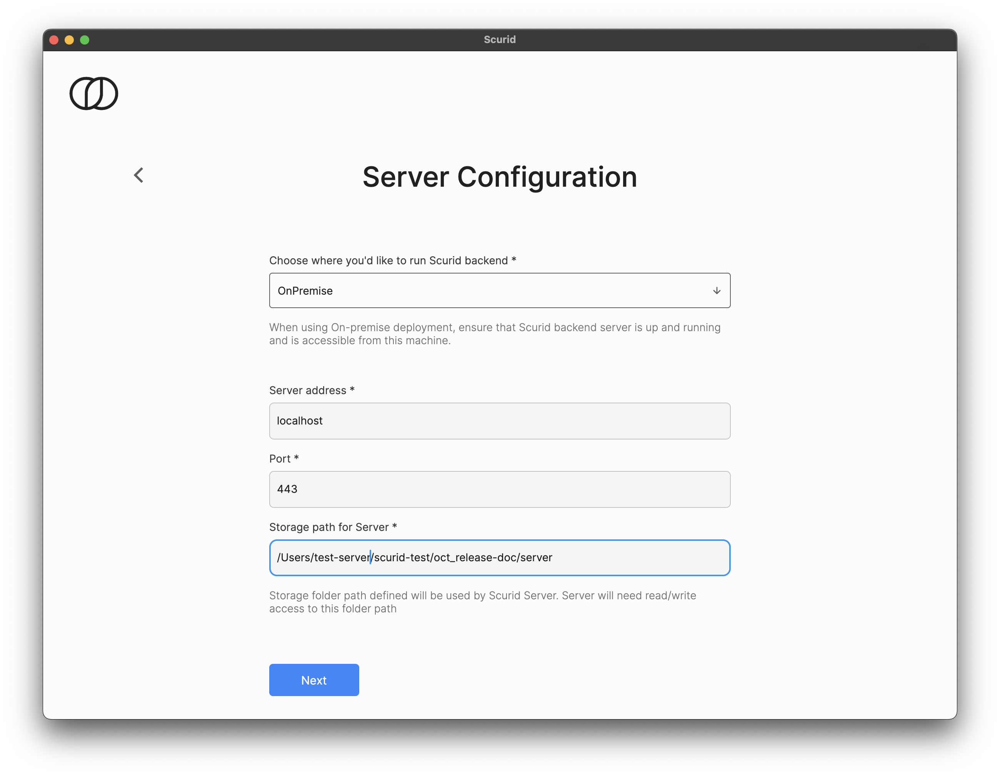

# Quickstart - On-Premise

## Overview
This page covers how to get started with Scurid Platform with on-premise deployment - by downloading and setting up required software components on your own infrastructure.

!!! info
   
      Scurid platform consists of three main components :

      1. Scurid [Edge Agent](https://www.scurid.com/products/edge-agent) and [MicroScurid-C SDK](https://www.scurid.com/products/micro-scurid-c)
      2. Scurid [Server](https://www.scurid.com/products/server)
      3. Desktop [App](https://www.scurid.com/products/app) (mobile app coming soon)   


??? tip "Interested in Managed deployment ?"

    If you are interested in Managed deployment, raise your request here [Support](https://support.scurid.cloud){ .md-button }


### Downloads
Navigate to [Getting Started](https://www.scurid.com/get-started) to download the latest version of Scurid software components.

??? info "Service Agreement"

    By downloading Scurid Software you agree to the [Service Agreement](https://www.scurid.com/service-agreement)

#### Download Scurid App

There are builds available for `linux`, `macos` and `windows` platforms. Download the appropriate build for your platform.

#### Download Scurid Server
Download the appropriate build for your platform from the downloads page. There are builds available for `linux`, `macos` and `windows` platforms.

1. Create a config folder and inside create a config.yaml file, with following content
    ```yaml
    ServerCert:
     CommonName: example.com # domain name of the server
     Country: DK # country
     Province: Copenhagen # city
     Locality: Copenhagen # city
     Organization: Example ApS # name of the organization
     OrganizationalUnit: Software Team # name of the team
     EmailAddress: info@example.com # email address
     LifetimeDays: 90 # number of days the certificate is valid
     SubjectAlternativeNames:
        - "*.yourcompany.com" # Wildcard domain
     CertStorageDirectory: certs
    Monitoring:
     Port: 8081 # default, used by prometheus
     Address: localhost # default, used by prometheus
    ```
2. Open a terminal and execute the downloaded Server binary, ensure that the terminal is not closed
    ```shell
    ./<binary name> -config config/config.yaml
    ```
=== "linux"
    ```shell
    ./<binary name-linux> -config config/config.yaml
    ``` 
=== "macos"
    ```shell
    ./<binary name-darwin> -config config/config.yaml
    ```

=== "windows"
    ```shell
    .\<binary name-windows> -config config/config.yaml
    ```

## Step 2 : Launching Scurid Server and App
This steps sets up the server and certain configurations that are needed in order to complete the user on-boarding process.

1. Launch the Scurid App   
2. Select Create a new instance, fill in your valid email address and accept the terms of service to Sign up 
3. Above step will email you with a code to verify your email
4. On the next screen pick the best pricing plan that suits your need. Scurid offers a free plan for non production use.
5. Select On-Premise and fill in the required server address, port and storage directory where you'd like Scurid Server to persist its data 
6. Select User type and click next 
7. Select your country, 
8. Enter your name and click next 
9. Enter the code sent on your email, and click next 
10. Create a 13 character long master passphrase, and click next 
11. We offer built in support for CockroachDB's Managed Serverless (perfect for PoCs and starter projects) or connect your own CockroachDB instance, or you can skip this step and configure it later. 


That's it. You are now ready to start deploying agents and start creating new identities using them.


## Step 3 : Deploying Scurid Edge Agent on your IoT hardware

Agent is a single binary, which can be easily configured to run as a service, on desired platform. It is a fully self-contained binary requiring no additional elements.

If you are downloading the agent for the first time on `linux` or related platform you may need to make the binary executable using 

Example : 
```shell
sudo chmod +x scuridedgeagent-linux-arm7 
```

Execute the binary, ensure that the terminal is not closed if the agent is not configured to run as a service.

Example :
```shell
./scuridedgeagent-linux-xxx -spaaddr 192.168.1.232:443 -syncrate 30s
```

If you do require to close the terminal you can run the service in the background and then disown , e.g.

```shell
./scuridedgeagent-linux-arm7 &
disown
```

The agent by default logs out some of the default configurations like the port details etc., additionally the agent starts listening on `localhost`
 