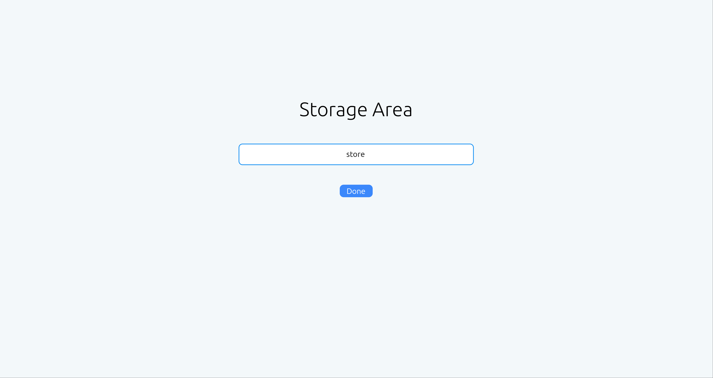
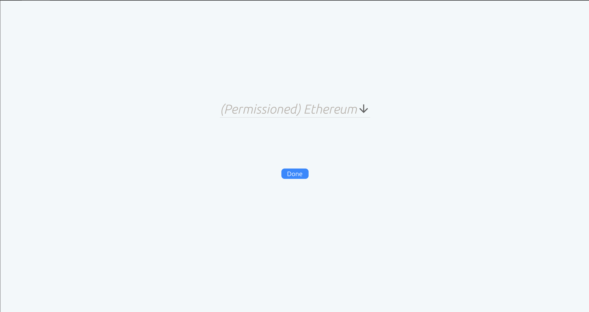
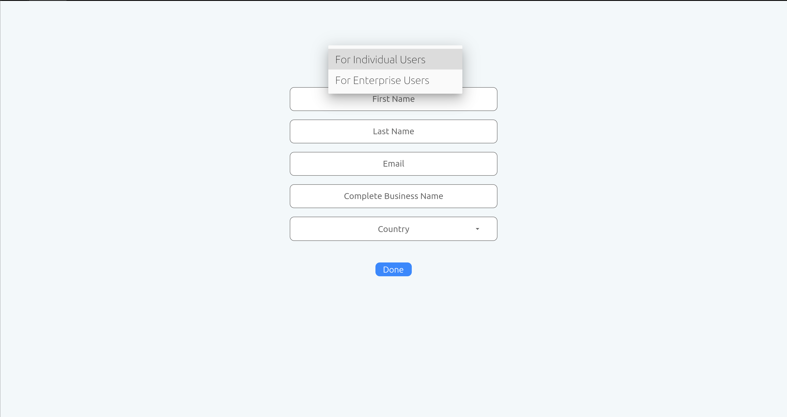
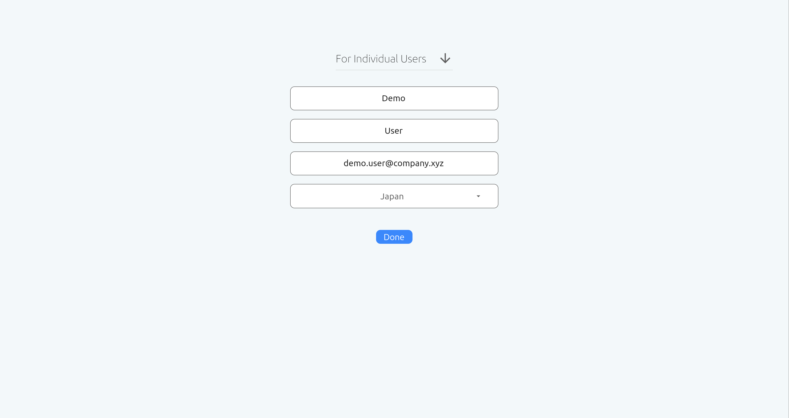
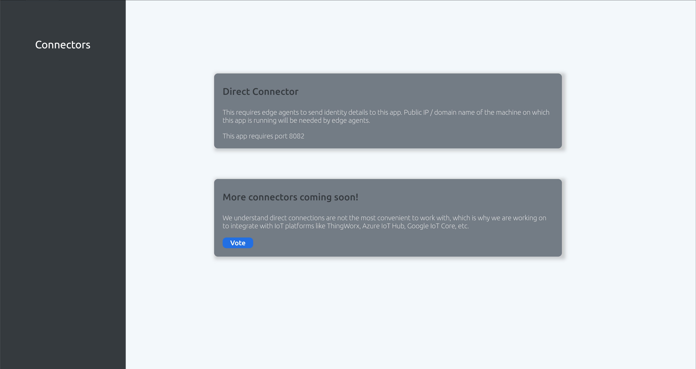
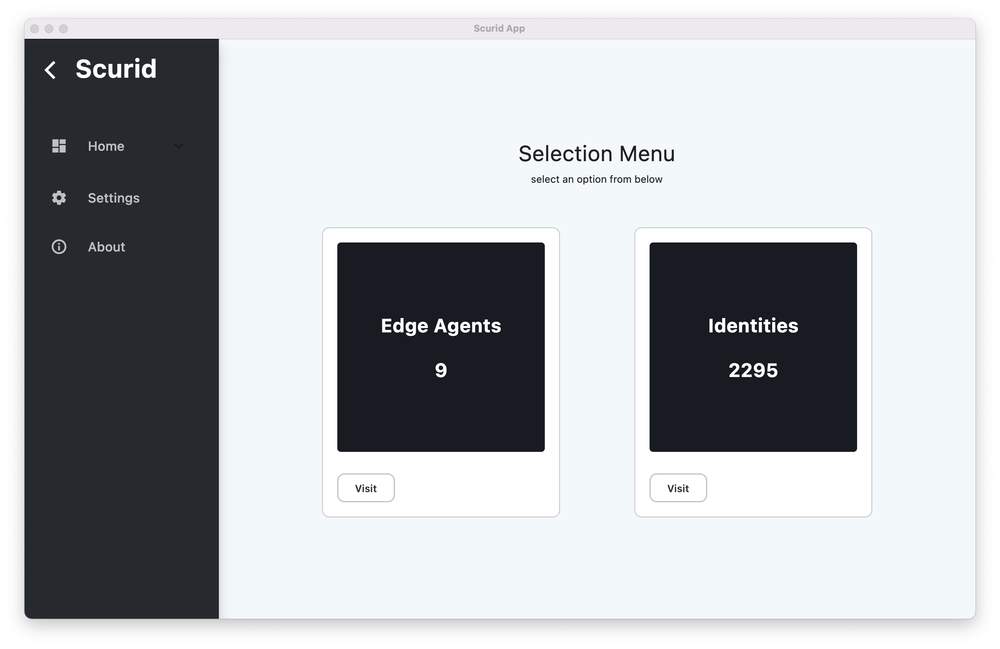

# Quickstart

This page covers how to get started with Scurid Platform by downloading and setting up software elements to on required IoT hardware and the dashboard to manage it 

### Step 1 : Download and setup Scurid App & Backend server

#### Pre-requisite for Scurid App
1. Ensure that the user running the application has sufficient rights to execute the application, you may have to make the app executable on linux for that run
=== "linux"
    
    ```shell
    sudo chmod +x scurid_flutter
    ```
   
2. Ensure the downloaded zip contains `data`, `lib` ,`Scurid_App` 
3. For `linux` run
=== "linux"
    
    ```shell
    sudo apt-get install libgtk-3-0 libblkid1 liblzma5
    ```

    
#### Scurid Platform app, is divided into two parts

a. Scurid App, which is a desktop native application for ID management, configuration & analytics. Download for your platform : [here](https://drive.google.com/drive/folders/1NognB5ughI3p_EdF26Bx851z9H8ErOVe?usp=sharing) 

b. Scurid Backend, is a server supporting the App functionalities and managing the communication with all the agents deployed in your IoT Ecosystem. Can be deployed on `On-Premise` or `Managed` 

=== "On-Premise"

    1. Download the binary for your platform from [here](https://drive.google.com/drive/folders/1cy_GmsOhy23SdMFTmfclmlHoKtDz7p_s?usp=sharing)
    2. Open a terminal and execute the binary
    === "linux"
        ```shell
        ./service-beta-vX.X.X-linux
        ``` 
    === "macos"
        ```shell
        ./service-beta-vX.X.X-darwin
        ```

    === "windows"
        ```shell
        ./service-beta-vX.X.X-win64
        ```

=== "Managed"

    [Contact us](https://scurid.us1.list-manage.com/subscribe?u=5fc1633bf19c6a638aa1dae34&id=c483d8b0a1) to setup an instance for you.


## Step 2 : User On-boarding
This steps sets up the server and certain configurations that are needed in order to complete the user on-boarding process.

1. Launch the Scurid App, downloaded in Step 1 
2. Setup the local storage area for the app, { width=800 }
3. Select available permissioned distributed ledger supported by Scurid, currently only Ethereum Clique is supported { width=800 }
4. Select the user type { width=800 }
5. Complete the form and continue, this may take a few seconds to finish. This will set up your account with our services esp. Scurid SSI service using the public/private key which is automatically setup for you by the Scurid backend. This public/private key will be used for authenticating your account with us. { width=800 }
6. Once completed, navigate to the home page with Direct connectors { width=800 }
7. This allows complete overview on the agents that are deployed in your network and the identities created using those identities { width=800 }


That's it. You are now ready to start deploying agents and start creating new identities using them.


## Step 3 : Deploying Scurid Edge Agent on your IoT hardware

Agent is a single binary, which can be easily configured to run as a service, on desired platform. It is a fully self-contained binary requiring no additional elements.

If you are downloading the agent for the first time on `linux` or related platform you may need to make the binary executable using 

```shell
sudo chmod +x scuridedgeagent-linux-arm7 
```
Note: It must be ensured that you have downloaded the correct binary for your platform.

Execute the binary, ensure that the terminal is not closed

```shell
./scuridedgeagent-linux-xxx
```

If you do require to close the terminal you can run the service in the background and then disown , e.g.

```shell
./scuridedgeagent-linux-arm7 &
disown
```

The agent by default logs out some of the default configurations like the port details etc., additionally the agent starts listening on `localhost`
 