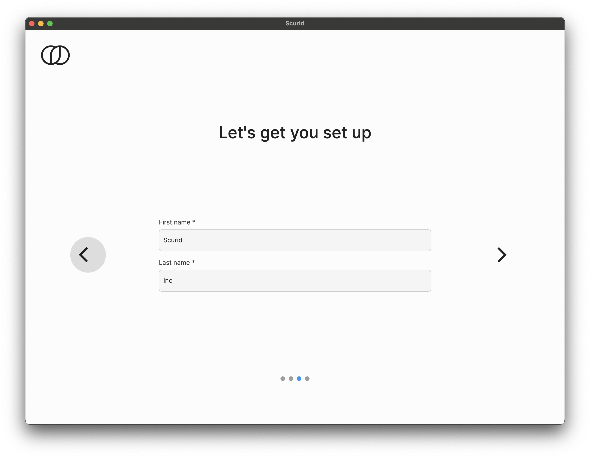
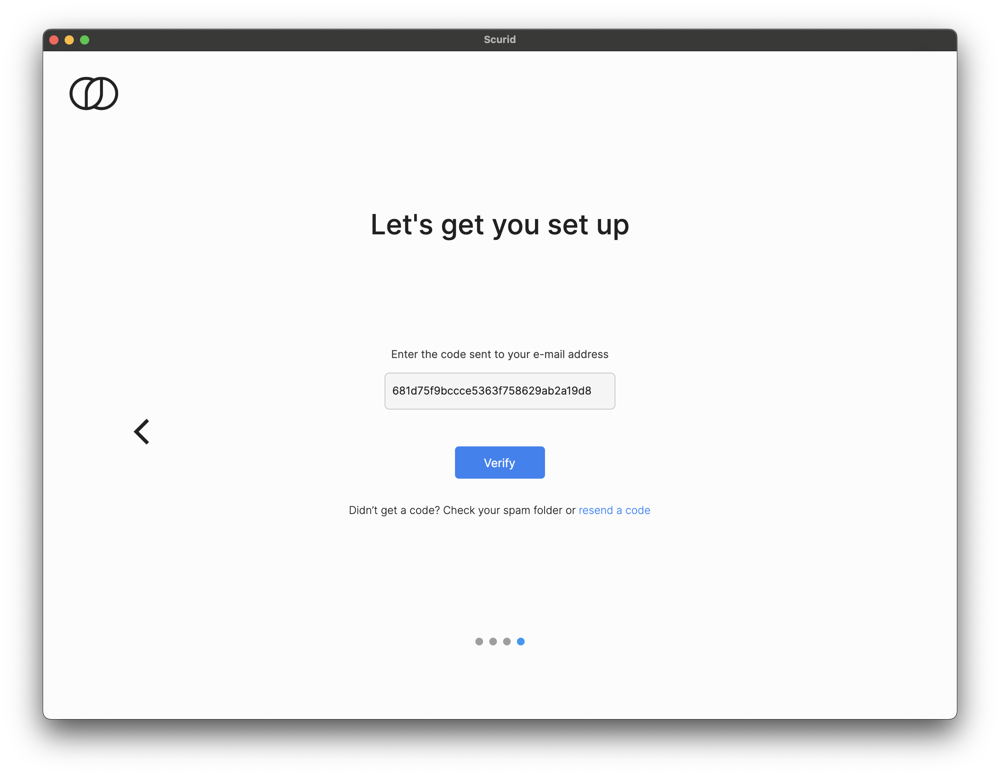
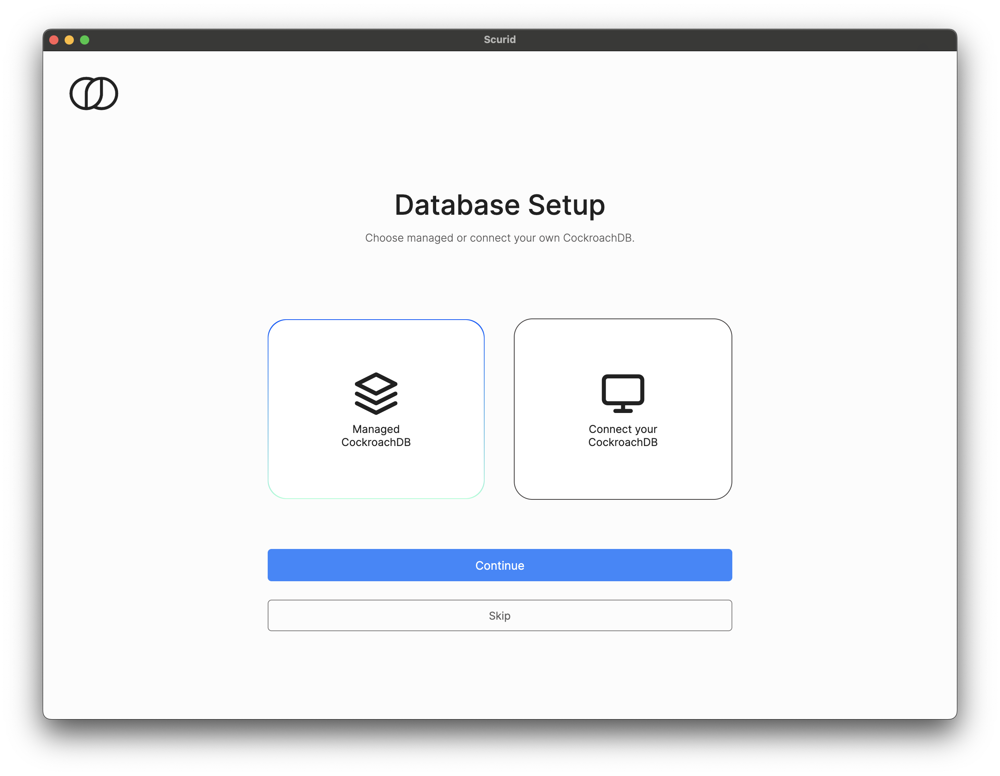

# Quickstart - For Managed Deployment

## Overview
This page covers how to get started with Scurid Platform with for Managed deployment.

!!! note "Need help with managed instance configuration details ?"

    Raise your request here [Support](https://support.scurid.cloud){ .md-button }

!!! info
   
      Scurid platform consists of three main components :

      1. Scurid [Edge Agent](https://www.scurid.com/products/edge-agent) and [MicroScurid-C SDK](https://www.scurid.com/products/micro-scurid-c)
      2. Scurid [Server](https://www.scurid.com/products/server)
      3. Desktop [App](https://www.scurid.com/products/app) (mobile app coming soon)   


### Downloads
Navigate to [Getting Started](https://www.scurid.com/get-started) to download the latest version of Scurid software components.

??? info "Service Agreement"

    By downloading Scurid Software you agree to the [Service Agreement](https://www.scurid.com/service-agreement)

#### Download Scurid App

There are builds available for `linux`, `macos` and `windows` platforms. Download the appropriate build for your platform.


## Step 2 : Launching Scurid App
This step sets up your account and other related configurations that are needed in order to complete the user on-boarding process.

1. Launch the Scurid App   
2. Select Create a new instance, fill in your valid email address and accept the terms of service to Sign up 
3. Above step will email you with a code to verify your email
4. On the next screen pick the best pricing plan that suits your need. Scurid offers a free plan for non production use.
5. Select `Managed` from the dropdown and fill in the required server address and port information received from Scurid 
6. Select User type and click next 
7. Select your country 
8. Enter your name and click next 
9. Enter the code sent on your email, and continue 
10. Create a 13 character long master passphrase, and click next 
11. We offer built in support for CockroachDB's Managed Serverless (perfect for PoCs and starter projects) or connect your own CockroachDB instance, or you can skip this step and configure it later. 


That's it. You are now ready to start deploying agents and start creating new identities using them.


## Step 3 : Deploying Scurid Edge Agent on your IoT hardware

Agent is a single binary, which can be easily configured to run as a service, on desired platform. It is a fully self-contained binary requiring no additional elements.

If you are downloading the agent for the first time on `linux` or related platform you may need to make the binary executable using 

Example : 
```shell
sudo chmod +x scuridedgeagent-linux-arm7 
```

Execute the binary, ensure that the terminal is not closed if the agent is not configured to run as a service.

Example :
```shell
./scuridedgeagent-linux-xxx -spaaddr scurid.democompany.com:<port> -syncrate 30s
```
