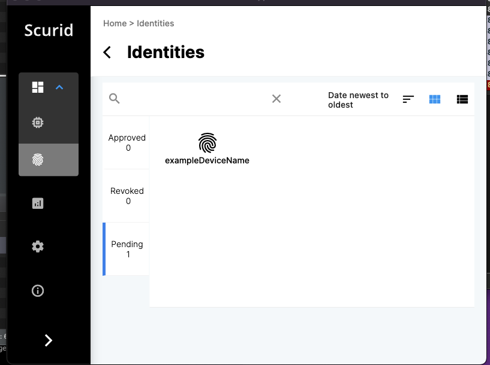

## Scurid App

Once the data is sent via the TLS connection, you can approve the device on the Scurid App.

Login to the Scurid App and open the `Identities` tab.
Inside the `Identities` tab, open the `Pending` tab.
You should see a register request if it was sent properly to the server.

Click on the device you want to approve, and click on approve at the bottom of the page

The approval process takes a few seconds to register the transaction on Scurid SSI service, which in turns registers the data on distributed ledger.

When the approval is done, you should be able to see confirmation on the Scurid App for respective identity.
Click anywhere outside the modal to exit.

The approved identity will appear in the `Approved` tab.

