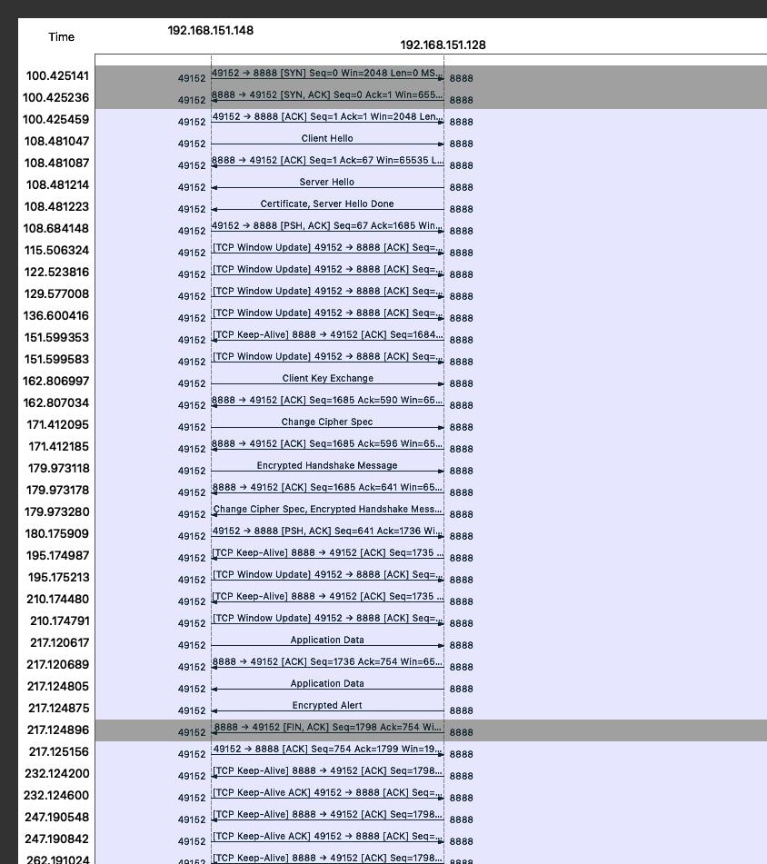

#### Adding the certificate

=== "STM32"
    STM32 uses [Mbed TLS](https://github.com/Mbed-TLS/mbedtls) and its APIs.

    Certificates are issued by Scurid, contact us at info@scurid.com.
    Add the content of the certificate to `examples/p-nucleo-wb55/Drivers/TLS/certificate.h`.
    To use the certificate in STM32, we must format the file so that it resembles the one below:

    ```c
    const char	self_signed_certificate[] =	\
    "-----BEGIN CERTIFICATE----- \r\n" \
    "MIIFPjCCAyagAwIBAgITc1wgneP76oa7kdwzfcsbFbziPjANBgkqhkiG9w0BAQsF \r\n" \
    "ADBkMQswCQYDVQQGEwJqcDEOMAwGA1UECBMFdG9reW8xDjAMBgNVBAcTBXRva3lv \r\n" \
    "MQ8wDQYDVQQKEwZzY3VyaWQxDzANBgNVBAsTBnNjdXJpZDETMBEGA1UEAxMKc2N1 \r\n" \
    "cmlkLmNvbTAeFw0yMjExMDExNzAwMzZaFw0yMjExMTMwNjQ3MTVaMGsxCzAJBgNV \r\n" \
    ...
    "8GshMG8AT85A56s/HVhd+/KW5IWCbz3KpyoG/Z5YBtKzxVEPI1bjZdmVHwlUDJVW \r\n" \
    "YxY= \r\n" \
    "-----END CERTIFICATE----- \r\n";
    ```

    Here is a simple python script to edit the certificate to this format:

    ```python
    file1 = open('ca.crt', 'r')
    Lines = file1.readlines()
    n = len(Lines)
    print(n)
    
    with open('ca-edited.crt', 'w') as f:
        for i, line in enumerate(Lines):
            if i == n - 1:
                f.write('"' + line.strip() + ' \\r\\n' + '"' + ";\n")
                break
            f.write('"' + line.strip() + ' \\r\\n' + '"' + " \\" + "\n")
    ```

=== "AMD64"

    Coming soon.

#### Actual code


=== "STM32"
    It takes about 2~3 minutes to establish the TLS connection on the STM32.

    ```c
    wiz_tls_context tlsContext;

	ret = wiz_tls_init(&tlsContext,&server_fd); // should return 1

	ret = wiz_tls_connect(&tlsContext, BACKEND_PORT, gServer_IP); // should return 0

    while (create_identity(task_interface->hrng, &did) == -1)
    {
        printf("Error generating did, trying again in 100ms...\r\n");
        HAL_Delay(100);
    }

    printf("\ndid:%s:%s\r\n\n", did.method, did.identifier);

    data_len = create_data_buffer(&did, g_send_buf, timestamp);

    /*  Write data to the SSL channel  */
    ret = wiz_tls_write(&tlsContext, g_send_buf, data_len);
    ```

    If running locally, you can check on Wireshark what is happening.
    The flow graph should look similar to here: 

=== "AMD64"
    Coming soon.
