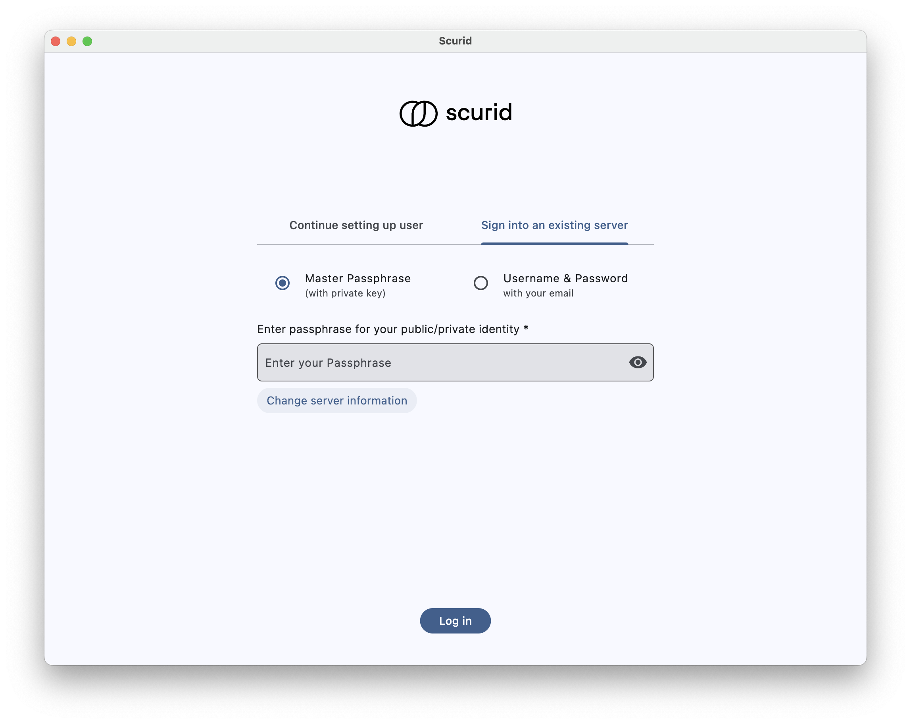
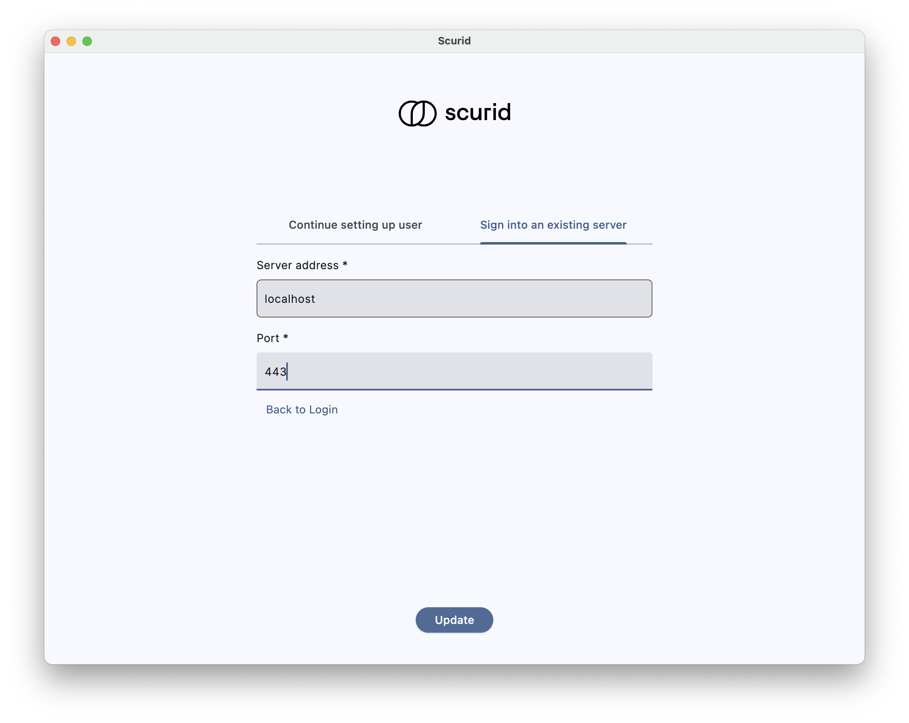

You may need to configure or reconfigure the Scurid Desktop App for several reasons, including:
* Accessing new features or updates
* Change in the Scurid Server IP address or port
* Reinstalling the app with a different Scurid Server IP address or port
* Accepting a pending user invitation

For this reason, the Scurid Desktop App allows you to configure the Scurid Server IP address and port. This is a one-time configuration that is required only when you first install the app or if you need to change the server settings.

## To Configure the Scurid Desktop App

1. Download and launch the Scurid App from [https://scurid.com/downloads](https://scurid.com/downloads).
2. Click **Sign into an existing server**  
   
3. Enter the Scurid Server IP address and port, then click **Update**  
   
4. Continue with the login process by entering your credentials.
