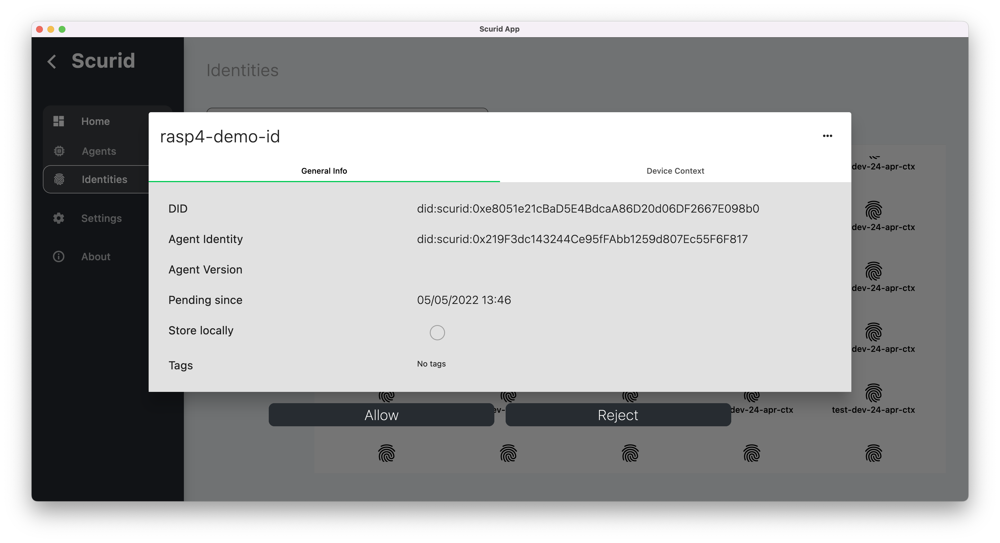
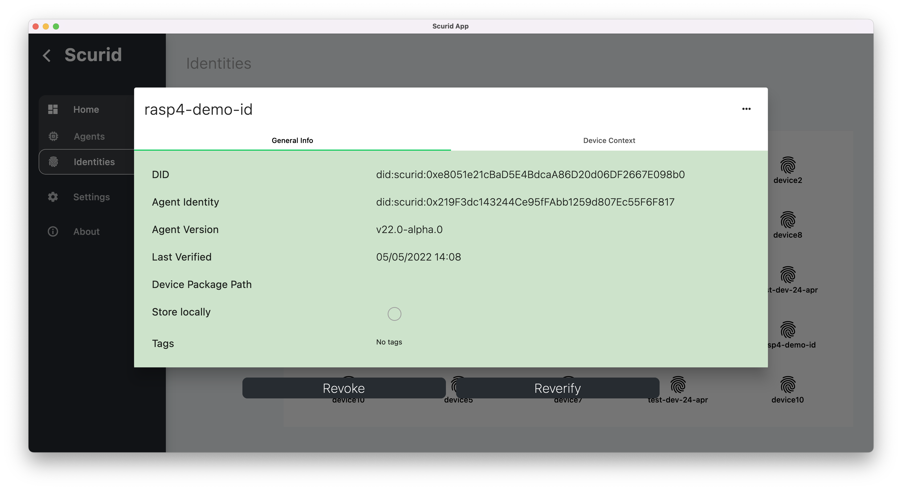
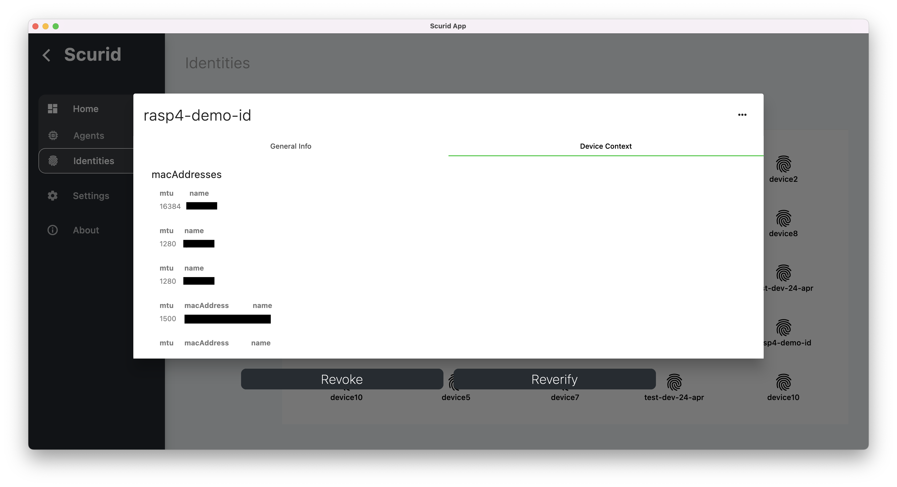

This tutorial provides a simplified overview on generating, approving device identity with APIs, and approving it using Scurid Platform App.

## Step 1. Generate an identity

Edge agent is required to run directly on the device, and it exposes gRPC based APIs for your IoT software to interact with. In order to register and monitor the identities generated by each agent you must tell the agent where the Scurid backend is running.

Depending on where the Scurid backend is deployed you'll need to pass the address

=== "On-Premise"

    If Scurid backed deployed and managed in your infrastructure.
    === "linux"
        ```shell
        ./scuridedgeagent-xxx-xxx --spaaddr my-server-address:443
        ``` 

    === "macos"
        ```shell
        ./scuridedgeagent-xxx-xxx --spaaddr my-server-address:443
        ```

    === "windows"
        ```shell
        ./scuridedgeagent-xxx-xxx --spaaddr my-server-address:443
        ```

=== "Managed"

    If Scurid backed deployed and managed by Scurid for you.
    === "linux"
        ```shell
        ./scuridedgeagent-xxx-xxx --spaaddr managed-demo.scurid.cloud:50050
        ``` 

    === "macos"
        ```shell
        ./scuridedgeagent-xxx-xxx --spaaddr managed-demo.scurid.cloud:50050
        ```

    === "windows"
        ```shell
        ./scuridedgeagent-xxx-xxx --spaaddr managed-demo.scurid.cloud:50050
        ```
Agent exposes a set of local gRPC APIs. That can be compiled in over 10 languages. The following are some examples in different programing languages

=== "Go"

    ```golang
    
    c := api.NewScuridEdgeAgentAPIClient(conn)
	res, err := c.CreateDeviceIdentity(context.Background(), &api.CreateDeviceIdentityReq{})
    ```

=== "Python"

    ```python
    
    def createidentitydemo():
    try:
        ireq = edgeagent_pb2.CreateDeviceIdentityReq()
        req = stub.CreateDeviceIdentity(ireq)
    except grpc.RpcError as e:
        print(f'failed setting: {e.details}')
    else:
        print(req)

    ```

=== "Javascript"

    ```js
    
    (async function () {
    const response = await GRPCService.runService('CreateDeviceIdentity');
    console.log(`CreateDeviceIdentity:response=`, response);
    })();

    ```

Identity generation produces following public key e.g. `did:scurid:0xe8051e21cBaD5E4BdcaA86D20d06DF2667E098b0`, uniquely identifying the device for a context. 

## Step 2. Send identity registration request

`RegisterDeviceIdentity` API enables your device IoT software to send new identity, generated in step above, to the Scurid backend server


=== "Go"

    ```golang
    
    c := api.NewScuridEdgeAgentAPIClient(conn)
    res, err := c.RegisterDeviceIdentity(context.Background(), &api.RegisterDeviceIdentityReq{
		Did:           "did:scurid:0xe8051e21cBaD5E4BdcaA86D20d06DF2667E098b0",
		UnixTime:      time.Now().Unix(),
		DeviceName:    "rasp4-demo-id",
		DeviceContext: nil,
	})
    ```

=== "Python"

    Example coming soon!

=== "Javascript"

    ```js
    
    const GRPCService = require('./lib/grpc-service');
    const moment = require('moment');
    const CREATE_INDENTITY_RESPONSE = { did: 'did:scurid:0xe8051e21cBaD5E4BdcaA86D20d06DF2667E098b0' };
    const DEVICE_NAME = 'rasp4-demo-id';

    (async function () {
    const response = await GRPCService.runService('RegisterDeviceIdentity', {
    did: CREATE_INDENTITY_RESPONSE.did,
    unixTime: moment().unix() * 1000,
    deviceName: DEVICE_NAME,
    deviceContext: {}
    });
    console.log(`RegisterDeviceIdentity:response=`, response);
    })();

    ```

## Step 3. Review pending identity

1. Navigate to the Scurid App's `Identities` > `Pending` list to review the pending identities 
2. Select the pending identity for the approval { width=800 }
3. Notice you can review the device context attached to the identity, click Allow
4. Once approved this identity can be viewed in the approved list { width=800 }
5. Device context, recorded together with the identity, is hashed and bound with each identity serving as identity's genesis information. { width=800 }

Once approved, an identity's workflow is completed, and it is ready for use with variety of different platforms like IoT or Analytics platforms etc.